[](https://classroom.github.com/a/zHsKfIy0)
# '디지털 보물찾기(Digital Treasure Quest)' 팀의 '일상대화 요약(Dialogue Summarization)' 경연 도전기

## Team

|  |  |  |  |
| :--------------------------------------------------------------: | :--------------------------------------------------------------: | :--------------------------------------------------------------: | :--------------------------------------------------------------: |
|            [박석](https://github.com/parksurk)             |            [백경탁](https://github.com/ktbaek72)             |            [한아름](https://github.com/Kerynhan)             |            [위효연](https://github.com/newwhy)             |
|                            Lead, R&D                             |                            R&D                             |                            R&D                             |                            R&D                             |

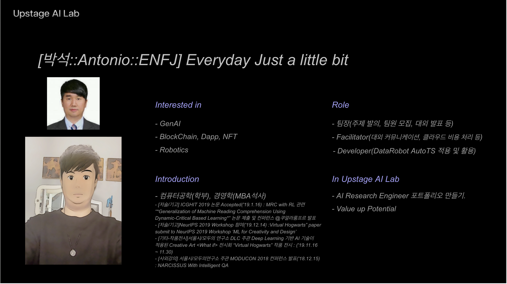
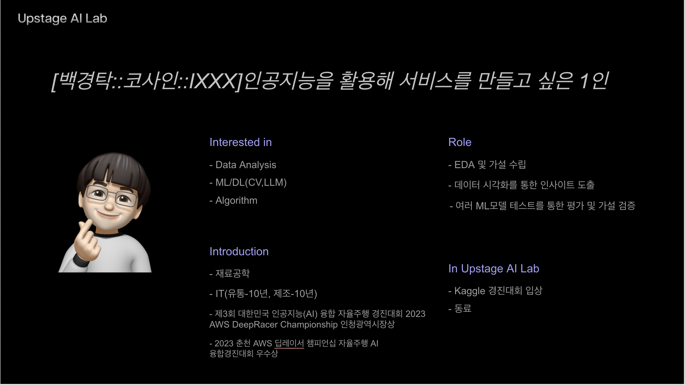
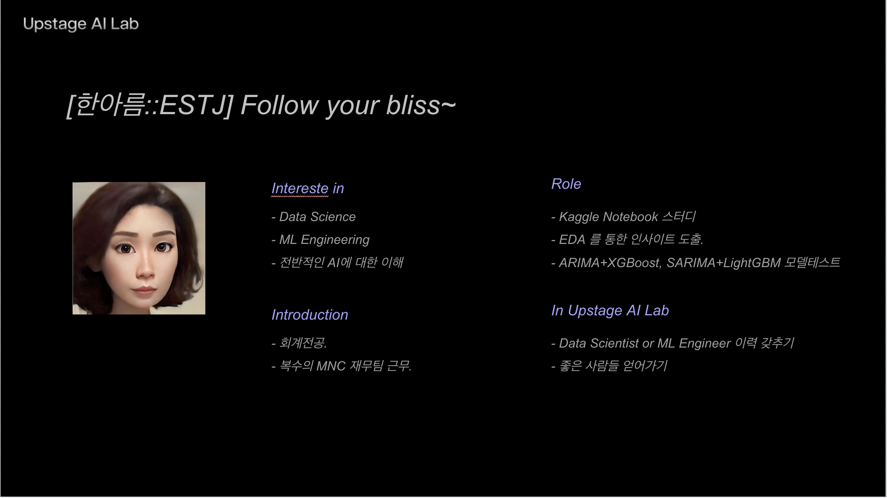
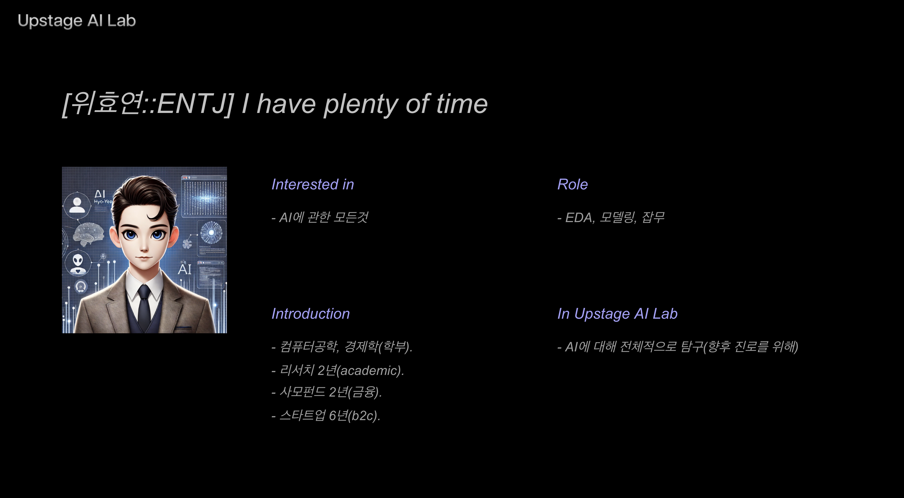


## 1. Competition Info

### 1.1. Overview

#### 대회 개요

##### 목표
일상 대화 데이터를 요약하는 모델을 개발합니다.

##### 소개
Dialogue Summarization 경진대회는 일상 대화를 바탕으로 요약문을 효과적으로 생성하는 모델을 개발하는 대회입니다. 일상생활에서 회의나 사소한 대화는 언제나 일어나지만, 이를 다시 들을 수 있는 시간은 제한적입니다. 요약을 통해 대화의 핵심을 빠르게 파악할 수 있어 업무 효율을 높일 수 있습니다. 참가자들은 자연어 처리 모델을 학습하여, 대화를 요약하는 자동화된 방법을 탐구하게 됩니다.

##### 제공 데이터셋
1. **학습 데이터**: 12,457개의 대화 및 그에 대응하는 요약문
2. **검증 데이터**: 499개의 대화 및 요약문
3. **테스트 데이터**: 250개의 대화 및 비공개 평가용 249개의 대화

##### 사용 가능한 알고리즘
딥러닝, Transformer 모델(BART, T5, GPT 등)과 같은 자연어 처리 모델을 활용하여 요약문 생성을 최적화할 수 있습니다. 대화의 맥락을 파악하고 적절한 요약을 생성할 수 있도록 다양한 알고리즘을 실험할 수 있습니다.

##### 모델링 목표
참가자들은 주어진 대화 데이터를 바탕으로 요약문을 생성하는 모델을 구축해야 합니다. 다양한 주제의 대화에서 핵심 정보를 추출하고 요약문을 작성하는 데 중점을 둡니다. 참가자들은 정확하고 일반화된 요약문을 생성하는 자연어 처리 모델을 개발하는 것이 목표입니다.

##### 제출 형식
CSV 파일로 결과물을 제출합니다.

- **Input**: 249개의 대화문
- **Output**: 249개의 예상 요약문

자세한 내용은 [대회 페이지](https://stages.ai/en/competitions/320/overview/description)에서 확인하세요.

### 1.2. Timeline

#### 프로젝트 전체 기간
- **2024년 8월 29일 (목) 10:00 ~ 2024년 9월 10일 (화) 19:00**

#### 주요 일정
- **프로젝트 시작**: 2024년 8월 29일 (목) 10:00
- **팀 병합 마감**: 2024년 9월 2일 (월) 16:00
- **개발 및 테스트 기간**: 2024년 8월 29일 (목) 10:00 ~ 2024년 9월 9일 (월) 19:00
- **최종 모델 제출**: 2024년 9월 10일 (화) 19:00

#### 상세 일정
1. **2024년 8월 29일 (목)**: 프로젝트 시작 및 데이터셋 준비
   - 데이터 탐색 및 전처리 시작
   - 팀 구성 및 역할 분담
   - 팀 병합 논의 시작
2. **2024년 8월 30일 (금)**: 공통 베이스라인 코드 작업
   - 팀 전체에서 공통 베이스라인 코드 개발 시작
   - 데이터 전처리 완료
3. **2024년 8월 31일 (토)**: 초기 모델 개발
   - 베이스라인 모델 학습 시작
   - 모델 성능 점검 및 개선 사항 논의
4. **2024년 9월 1일 (일)**: 모델 검증 및 성능 향상
   - 베이스라인 모델 성능 평가 및 분석
   - 하이퍼파라미터 튜닝 및 모델 개선 논의
5. **2024년 9월 2일 (월)**: 팀 병합 마감
   - 최종 팀 병합 및 구조 조정
   - 초기 모델 학습 완료
6. **2024년 9월 3일 (화)**: 모델 고도화
   - 딥러닝 모델 구조 개선 및 고도화 작업
   - 다양한 모델 시도 및 실험
7. **2024년 9월 4일 (수)**: 성능 검증 및 개선
   - 검증 데이터 기반 모델 성능 평가
   - 에러 분석 및 추가 개선 작업
8. **2024년 9월 5일 (목)**: 추가 데이터 처리 및 개선
   - 피드백 기반 모델 수정 및 데이터 증강 시도
9. **2024년 9월 6일 (금)**: 최적화 작업
   - 모델 최적화 및 성능 극대화
   - 추가 피처 엔지니어링 및 성능 분석
10. **2024년 9월 7일 (토)**: 결과 검토 및 문서화
    - 최종 모델 결과 분석 및 검토
    - 모델 개발 과정 문서화 시작
11. **2024년 9월 8일 (일)**: 최종 점검
    - 최종 모델 점검 및 성능 확인
    - 결과 정리 및 최종 검토
12. **2024년 9월 9일 (월)**: 최종 테스트 및 제출 준비
    - 최종 모델 테스트 및 제출 준비 완료
13. **2024년 9월 10일 (화)**: 최종 모델 제출
    - 최종 모델 제출 및 프로젝트 종료

이렇게 첫 주 동안 팀 공통 베이스라인 코드를 중점적으로 개발하고, 이후 각 팀원들이 성능 개선 및 고도화 작업을 할 수 있는 일정으로 구성했습니다.

### 1.3. Evaluation

#### 평가방법

이번 대회는 **Dialogue Summarization**을 목표로 하는 **요약 생성 대회**입니다. 참가자들이 개발한 모델은 **ROUGE** 메트릭을 기준으로 평가됩니다.

##### ROUGE란?
ROUGE(Recall-Oriented Understudy for Gisting Evaluation)는 텍스트 요약 및 기계 번역과 같은 자연어 처리 태스크에서 널리 사용되는 평가 지표입니다. ROUGE는 모델이 생성한 요약문과 참조 요약문 간의 일치 정도를 측정하며, 주로 **ROUGE-1**, **ROUGE-2**, **ROUGE-L**로 구분됩니다.

- **ROUGE-1**: 모델 요약문과 참조 요약문 간에 겹치는 unigram(단어)의 수를 비교하는 지표입니다.
- **ROUGE-2**: 모델 요약문과 참조 요약문 간에 겹치는 bigram(2개의 연속된 단어)의 수를 비교하는 지표입니다.
- **ROUGE-L**: 최장 공통 부분열(LCS, Longest Common Subsequence)을 기반으로 한 지표로, 문장의 등장 순서까지 고려한 평가 방식입니다.

##### ROUGE-F1 Score
ROUGE 메트릭은 **Precision**(정밀도)과 **Recall**(재현율)의 조화 평균을 나타내는 **F1 Score**로 평가됩니다. 이 F1 Score는 참조 요약문과 비교했을 때, 모델이 얼마나 중요한 정보를 잘 포함했는지와 함께, 얼마나 간결하게 잘 표현했는지를 평가합니다.

##### 계산 방법

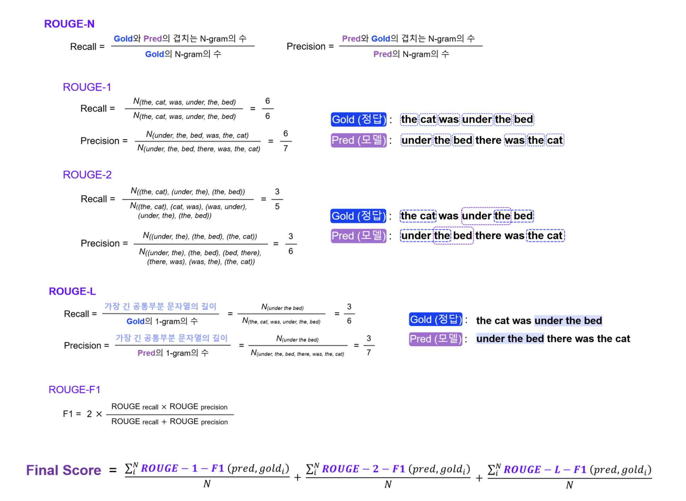

모델이 생성한 요약문은 하나의 대화당 3개의 참조 요약문과 비교되며, 각 참조 요약문에 대해 산출된 **ROUGE-1**, **ROUGE-2**, **ROUGE-L**의 F1 Score 평균이 최종 점수로 사용됩니다. 이렇게 여러 참조 요약문과 비교함으로써 다양한 관점에서의 요약 품질을 평가할 수 있습니다.

##### 평가 기준
- **ROUGE-1-F1**, **ROUGE-2-F1**, **ROUGE-L-F1**: 각각의 점수를 계산하여 세 점수의 평균을 구합니다. 이 평균 점수가 최종 점수로 사용됩니다.
- 다수의 참조 요약문을 고려하여 평균을 산출하기 때문에, 다중 참조 기반의 점수 산출이 이루어집니다.

##### 한국어 요약문 평가


- **형태소 분석기**: 한국어 데이터의 경우, 정확한 평가를 위해 형태소 분석기를 사용하여 문장을 토큰화합니다. 이는 의미 있는 최소 단위로 문장을 쪼개어 ROUGE 점수를 보다 정확하게 산출하기 위한 과정입니다.

##### Public 및 Private 평가
- **Public 평가**: 공개된 테스트 데이터의 50%를 사용하여 리더보드 점수가 산출됩니다.
- **Private 평가**: 나머지 비공개 테스트 데이터를 사용하여 최종 리더보드 점수가 산출됩니다.

자세한 내용은 [ROUGE 참고자료](https://stages.ai/en/competitions/320/overview/evaluation)에서 확인하세요.

## 2. Winning Strategy

### 2.1. DTQ Team's Pros and Cons
#### Pros
- 다양한 경력과 경험을 가진 팀원들
- 다양한 뷰 포인트와 색깔를 가진 팀원들
- AI Assistant에 대한 수용력이 높음

#### Cons 
- Git을 활용한 팀단위의 R&D 경험 수준 낮음
- Python기반 R&D 경험 수준 낮음
- 머신러닝/딥러닝 R&D 경험 수준 낮음
- 경연 주제와 관련된 도메인 지식이 낮음
- Career Path에 대한 개인적인 목표가 모두 다름 

### 2.2. DTQ Team's strategic approach
- 첫째, Jupyter notebook이 아닌 커멘드라인 인터페이스로 동작하는 팀 베이스라인 코드를 구축하여 팀 단위 협업을 가능하게 한다.
- 둘째, ChatGPT와 같은 AI활용 도구를 적극 활용하여 EDA 와 Model Selection 의 방향성을 잡는다.
- 셋째, 팀원별 서로 다른 머신러닝 모델링을 각 팀원별 수준에 맞게 진행한다.

### 2.3. DTQ Team's culture & spirit
- 경연 참가의 목적은 개인별 학습을 통해 머신러닝 R&D에 필요한 지식과 경험을 얻는 것에 있다.
- 팀원 각각이 처한 상황을 서로 이해하고 인정하고 Respect 한다.
- AI Assistant를 적극적으로 활용하여 개인별 생산성을 극대화 한다.
- 팀 전체 목표을 위해 팀원 개개인의 스케쥴이나 리소스를 희생해서는 안된다.
- 팀원별로 최소한 한번의 제출은 해 본다.

## 3. Components

### 3.1. Directory

- code : 팀원별 실험 소스 코드 및 관련 문서
  - tm1 : 팀원(박석) 실험 소스 코드 및 관련 문서
  - tm2 : 팀원(백경탁) 실험 소스 코드 및 관련 문서
  - tm3 : 팀원(한아름) 실험 소스 코드 및 관련 문서
  - tm4 : 팀원(위효연) 실험 소스 코드 및 관련 문서
  - team : 팀전체 협업을 위한 실험 소스 코드 및 관련 문서
- docs : 팀 문서(발표자료, 참고자료 등)
  - presentation : 발표자료
  - reference : 참고자료
- images : 첨부 이미지
- README.md : 디지털 보물찾기(Digital Treasure Quest)' 팀의 '일상대화 요약' 경연 도전기 Readme.md

## 4. Data description

### 4.1. Dataset overview

#### 학습 데이터
| **Desc**       | **Details**                          |
|----------------|--------------------------------------|
| File name      | train.csv                            |
| Rows           | 12,457                               |
| Columns        | 3                                    |
| fname          | 대화 고유 번호                        |
| dialogue       | 최소 2명에서 최대 7명이 참여하는 대화문 |
| summary        | 대화문을 요약한 문장                  |

#### 검증 데이터
| **Desc**       | **Details**                          |
|----------------|--------------------------------------|
| File name      | dev.csv                              |
| Rows           | 499                                  |
| Columns        | 3                                    |
| fname          | 대화 고유 번호                        |
| dialogue       | 검증용 대화문                        |
| summary        | 검증용 대화문 요약                   |

#### 테스트 데이터
| **Desc**       | **Details**                          |
|----------------|--------------------------------------|
| File name      | test.csv                             |
| Rows           | 250                                  |
| Columns        | 3                                    |
| fname          | 대화 고유 번호                        |
| dialogue       | 테스트용 대화문                      |
| summary        | 테스트용 대화문 요약                 |

#### 히든 테스트 데이터
| **Desc**       | **Details**                          |
|----------------|--------------------------------------|
| Descrption     | hidden test                      |
| Rows           | 249                                  |
| Columns        | 2                                    |
| fname          | 대화 고유 번호                        |
| dialogue       | 비공개 평가용 대화문                  |
| summary        | 비공개 평가용 요약문                 |

### 4.2. EDA

#### Feature Description

| **Feature Name** | **Index** | **Description**                             |
|------------------|-----------|---------------------------------------------|
| fname            | 1         | 대화의 고유 식별 번호                         |
| dialogue         | 2         | 대화문 (최소 2명, 최대 7명이 참여)             |
| summary          | 3         | 대화 내용을 요약한 문장                        |

#### EDA 결과

1. **대화 길이 분석**: 대화는 최소 2턴에서 최대 60턴으로 이루어져 있으며, 대화 참여자 수는 최소 2명에서 최대 7명까지입니다.
2. **발화자 구분**: 발화자는 `#PersonN#` 형식으로 구분되며, 발화자의 대화 끝에는 `\n`이 추가되어 있습니다.
3. **요약문 분석**: 각 대화는 대화의 내용을 요약한 한 문장으로 표현되어 있습니다. 요약문은 대화 주제에 따라 간결하면서도 핵심적인 내용을 담고 있습니다.
4. **평가 방식**: 테스트 및 검증 데이터는 3개의 다른 요약문과 비교되며, **ROUGE** 메트릭을 통해 모델 성능이 평가됩니다.

EDA 결과에 따라 데이터 전처리 시 발화자 구분, 대화 길이, 요약문을 고려하여 데이터 변환이 필요하며, 모델 학습에 중요한 정보는 대화의 흐름을 반영하는 요약문입니다.

### 4.3. Data Processing

#### 1. **Preprocessing 클래스**

이 클래스는 다양한 언어의 대화 데이터를 모델의 입력으로 변환하기 위한 중요한 전처리 과정입니다. `bos_token`과 `eos_token`을 통해 대화의 시작과 끝을 명확하게 구분하여 모델이 문장을 이해할 수 있도록 돕습니다. 특히 다양한 언어를 지원하기 위한 전처리 방식은 데이터의 일관성과 유연성을 보장하는 데 중요한 역할을 합니다.

- **`__init__(self, bos_token: str, eos_token: str)`**: 주어진 언어에 적합한 시작 토큰(`bos_token`)과 종료 토큰(`eos_token`)을 설정하여 대화 요약 과정에서 문장의 시작과 끝을 명확히 구분합니다. 다국어 지원을 위해 토큰화에 사용하는 모델의 특수 토큰을 정의하는 것이 중요합니다.
  
- **`make_set_as_df(file_path, is_train=True)`**: CSV 파일을 DataFrame으로 불러옵니다. 학습 데이터는 대화문과 요약문을 포함하고 있지만, 테스트 데이터는 요약문이 없기 때문에 대화문만 반환합니다. 다국어 데이터를 처리할 때는 CSV 파일 인코딩과 같은 언어별 차이점도 고려해야 합니다.
  
- **`make_input(dataset, is_test=False)`**: 모델 입력을 생성하는 함수입니다.
  - 학습 데이터의 경우: `encoder_input`은 대화문(`dialogue`), `decoder_input`은 시작 토큰을 포함한 요약문(`bos_token + summary`), `decoder_output`은 요약문과 종료 토큰(`summary + eos_token`)을 포함합니다.
  - 테스트 데이터의 경우: 요약문이 없으므로 `encoder_input`은 대화문, `decoder_input`은 시작 토큰만을 포함합니다. 다양한 언어의 특성에 맞는 전처리를 적용하여 언어별 특이성을 반영합니다.

#### 2. **Dataset 클래스**

학습, 검증, 테스트 데이터를 효율적으로 처리하기 위한 세 가지 데이터셋 클래스를 정의합니다. 이 클래스들은 각 언어에 맞는 데이터를 처리하여 모델에 적합한 형식으로 변환합니다.

- **DatasetForTrain**: 학습 데이터를 위한 클래스입니다. `encoder_input`과 `decoder_input` 및 `labels`를 생성하여 학습 데이터를 모델에 적합하게 처리합니다. 다양한 언어의 텍스트를 처리할 수 있도록 설계되어 있으며, 대화 데이터를 다루는 데 특화되어 있습니다.
  
- **DatasetForVal**: 검증 데이터를 처리하는 클래스입니다. `DatasetForTrain`과 유사한 구조로 검증 데이터를 처리하여 모델 성능을 평가할 수 있습니다.
  
- **DatasetForInference**: 테스트 데이터를 처리하는 클래스입니다. 이 클래스는 대화문만 입력받으며, 요약문이 없는 테스트 데이터를 위한 구조입니다. 여러 언어의 대화를 분석하는 데 있어 발화자와 문맥을 구분하여 처리할 수 있습니다.

#### 3. **데이터셋 준비**

데이터셋 준비 단계에서는 학습 및 테스트 데이터를 모델 학습에 적합한 형식으로 변환합니다. LLM(대규모 언어 모델, Large Language Model)은 다국어 지원을 위해 다양한 데이터셋을 유연하게 처리할 수 있습니다.

- **prepare_train_dataset(config, preprocessor, data_path, tokenizer)**:
  - `train.csv`와 `dev.csv` 파일을 불러와 데이터프레임으로 변환합니다.
  - `Preprocess` 클래스를 사용하여 대화 데이터를 모델 입력과 출력으로 변환합니다.
  - 다국어 데이터의 경우, 각 언어에 적합한 토크나이저를 사용하여 텍스트를 토큰화합니다. 토크나이저는 언어별 특수 문자를 처리할 수 있어야 하며, 이는 한국어와 같은 복잡한 언어를 다룰 때 매우 중요합니다.
  - 학습 데이터셋(`DatasetForTrain`)과 검증 데이터셋(`DatasetForVal`)을 생성하여 학습에 필요한 데이터를 준비합니다.

- **prepare_test_dataset(config, preprocessor, tokenizer)**:
  - `test.csv` 파일을 불러와 테스트 데이터를 준비합니다.
  - 테스트 데이터는 요약문이 없기 때문에, 대화문만을 토큰화하여 `DatasetForInference`로 준비됩니다. 다양한 언어를 지원하기 위해, 토크나이저가 여러 언어에 대응할 수 있도록 설정합니다.

#### 4. **Dataloader 생성**

`create_dataloaders` 함수는 학습 및 검증 데이터셋에 대한 `DataLoader`를 생성합니다.

- **train_dataloader**: 학습 데이터를 배치 단위로 처리하여 모델에 입력합니다. 배치 크기 및 데이터의 셔플 여부는 설정 파일에 정의되며, 다국어 데이터를 처리할 수 있도록 설계되어 있습니다.
  
- **val_dataloader**: 검증 데이터를 처리하며, 학습 데이터와 동일한 방식으로 토크나이즈된 데이터를 처리합니다.

#### 5. **최근의 LLM 기반 다국어 데이터 처리 접근 방식**

최근의 LLM들은 다국어 지원을 위한 새로운 접근 방식들을 적극적으로 활용하고 있습니다. 특히, 대화 요약을 다루는 작업에서 다음과 같은 방식이 주로 사용됩니다.

- **다국어 토크나이저 (Multilingual Tokenizers)**: 최근의 LLM들은 다양한 언어의 복잡한 구조를 처리할 수 있는 다국어 토크나이저를 사용합니다. 예를 들어, BERT 기반의 `mBERT`나 GPT-3 기반의 다국어 지원 토크나이저를 활용하여 언어별 특성을 반영한 토크나이징이 가능해졌습니다.
  
- **전이 학습 (Transfer Learning)**: 다국어 모델은 전이 학습을 통해 다양한 언어로 확장할 수 있습니다. 한 언어에서 학습된 모델을 다른 언어의 데이터에 적용하는 방식으로, 대규모 다국어 코퍼스를 통해 LLM의 성능을 극대화할 수 있습니다.

- **언어 간 지식 공유 (Cross-lingual Knowledge Sharing)**: 최신 LLM은 하나의 언어로 학습된 정보를 다른 언어로 전이하는 기능을 통해, 한 언어에서의 성능을 다른 언어에서도 재현할 수 있습니다. 이를 통해 다국어 요약 작업에서 일관된 성능을 유지할 수 있습니다.

- **다국어 데이터 증강 (Multilingual Data Augmentation)**: 다국어 모델을 훈련할 때, 데이터 증강 기법을 사용하여 다양한 언어 데이터를 생성하고 학습 성능을 개선합니다. 이는 소수 언어 데이터를 보충하는 데 유용하며, 언어 간의 차이점을 극복하는 데 도움이 됩니다.

#### 6. **한국어 및 다양한 언어 처리 시 고려 사항**
한국어를 포함한 다양한 언어에 대한 데이터 전처리 과정에서는 각 언어의 특성에 맞는 토크나이저와 전처리 방식을 적용해야 합니다. 특히 다음 사항을 고려해야 합니다.

- **토크나이저 선택**: 한국어와 같이 어순이 유연하고 복잡한 형태소 구조를 가진 언어의 경우, 적합한 한국어 토크나이저(KoBERT, KoGPT, Mecab 등)를 사용하는 것이 중요합니다. 다른 언어의 경우에도 언어별 특화 토크나이저를 사용하는 것이 좋습니다.
  
- **언어별 데이터 정제**: 한국어의 조사나 어미 처리, 영어의 대소문자 구분, 중국어의 문자 구분 등 언어별로 문법 구조와 특성에 맞는 정제 작업이 필요합니다.

- **다국어 요약의 일관성**: 다국어 요약 작업에서 중요한 점은 언어 간의 일관성을 유지하는 것입니다. 예를 들어, 동일한 문맥에서 각 언어의 요약문이 다른 의미를 가지지 않도록 정교한 전처리와 후처리 작업이 필요합니다.

이 전처리 파이프라인은 다양한 언어에서 대화 데이터를 효율적으로 처리하고, 요약문을 생성하는 데 필요한 기본적인 요소를 포함하고 있습니다. 최근의 LLM 접근 방식인 다국어 토크나이저, 전이 학습, 언어 간 지식 공유 등을 적극 활용하여, 다양한 언어를 다루는 요약 작업에서 최적의 성능을 도출할 수 있습니다. 한국어를 포함한 복잡한 언어 처리 시에는 언어 특성을 반영한 전처리 과정을 신중하게 설계하는 것이 중요합니다.

## 5. Modeling

## 5.1 Text Classification - 상품리뷰에 대한 긍정/부정 분석(Positive Negative) (팀 전체))

이 저장소에는 순환 신경망(LSTM)과 합성곱 신경망(CNN)을 사용한 단순한 텍스트 분류의 구현이 포함되어 있습니다([Kim 2014](http://arxiv.org/abs/1408.5882) 참조). 학습할 아키텍처를 지정해야 하며, 두 가지를 모두 선택할 수 있습니다. 두 아키텍처를 모두 선택하여 문장을 분류하면 단순 평균으로 앙상블 추론이 이루어집니다.

### 5.1.1 사전 요구 사항

- Python 3.6 이상
- PyTorch 1.6 이상
- PyTorch Ignite
- TorchText 0.5 이상
- [torch-optimizer 0.0.1a15](https://pypi.org/project/torch-optimizer/)
- 토크나이즈된 코퍼스(예: [Moses](https://www.nltk.org/_modules/nltk/tokenize/moses.html), Mecab, [Jieba](https://github.com/fxsjy/jieba))

BERT 파인튜닝을 사용하려면 다음도 필요할 수 있습니다.

- Huggingface

추가 요구사항
- SKlearn
- WandB

### 5.1.2 설치

#### 5.1.2.1 로컬PC Python 가상환경 설정
conda 환경을 새로 생성한 후 필요한 라이브러리를 설치합니다.

```bash
conda create -n nlp-plm python=3.12
conda activate nlp-plm
conda install pytorch torchvision torchaudio torchtext -c pytorch
conda install -c pytorch ignite
conda install packaging
pip install torch_optimizer
conda install -c conda-forge transformers
pip install scikit-learn
pip install wandb
```

#### 5.1.2.2 Colab 설정
```bash

# PyTorch 및 관련 패키지 설치
!pip install torch torchvision torchaudio

# torch_optimizer 설치
!pip install torch_optimizer

# ignite 설치
!pip install pytorch-ignite

# Transformers 설치
!pip install transformers

# SKLearn
!pip install scikit-learn

# WandB 설치
!pip install wandb

```

### 5.1.3 사용 방법

#### 5.1.3.1 준비

##### 5.1.3.1.1 형식

입력 파일은 클래스와 문장 두 개의 열로 구성되며, 이 열들은 탭으로 구분됩니다. 클래스는 숫자가 아니어도 되며, 공백 없이 단어로 작성될 수 있습니다. 아래는 예제 코퍼스입니다.

```bash
$ cat ./data/raw_corpus.txt | shuf | head
positive	나름 괜찬항요 막 엄청 좋은건 아님 그냥 그럭저럭임... 아직 까지 인생 디퓨져는 못찾은느낌
negative	재질은플라스틱부분이많고요...금방깨질거같아요..당장 물은나오게해야하기에..그냥설치했어요..지금도 조금은후회중.....
positive	평소 신던 신발보다 크긴하지만 운동화라 끈 조절해서 신으려구요 신발 이쁘고 편하네요
positive	두개사서 직장에 구비해두고 먹고있어요 양 많아서 오래쓸듯
positive	생일선물로 샀는데 받으시는 분도 만족하시구 배송도 빨라서 좋았네요
positive	아이가 너무 좋아합니다 크롱도 좋아라하지만 루피를 더..
negative	배송은 기다릴수 있었는데 8개나 주문했는데 샘플을 너무 적게보내주시네요ㅡㅡ;;
positive	너무귀여워요~~ㅎ아직사용은 못해? f지만 이젠 모기땜에 잠설치는일은 ? j겟죠
positive	13개월 아가 제일좋은 간식이네요
positive	지인추천으로 샀어요~ 싸고 가성비 좋다해서 낮기저귀로 써보려구요~
```

##### 5.1.3.1.2 토크나이징(선택 사항)

코퍼스의 문장을 토크나이징해야 할 수 있습니다. 언어에 따라 자신에게 맞는 토크나이저를 선택해야 합니다(예: 한국어의 경우 Mecab).

```bash
$ cat ./data/raw_corpus.txt | awk -F'\t' '{ print $2 }' | mecab -O wakati > ./data/tmp.txt
$ cat ./data/raw_corpus.txt | awk -F'\t' '{ print $1 }' > ./data/tmp_class.txt
$ paste ./data/tmp_class.txt ./data/tmp.txt > ./data/corpus.txt
$ rm ./data/tmp.txt ./data/tmp_class.txt
```

##### 5.1.3.1.3 셔플 및 학습/검증 세트 분할

적절한 형식화와 토크나이징 후에는 코퍼스를 학습 세트와 검증 세트로 분할해야 합니다.

```bash
$ wc -l ./data/corpus.txt
302680 ./data/corpus.txt
```

보시다시피, 코퍼스에는 260k개 이상의 샘플이 있습니다.

```bash
$ cat ./data/corpus.txt | shuf > ./data/corpus.shuf.txt
$ head -n 62680 ./data/corpus.shuf.txt > ./data/corpus.test.txt
$ tail -n 240000 ./data/corpus.shuf.txt > ./data/corpus.train.txt
```

이제 240,000개의 학습 세트 샘플과 62,680개의 검증 세트 샘플이 있습니다. MacOS를 사용하는 경우, 'shuf' 대신 'rl' 명령어를 사용할 수 있습니다.

#### 5.1.3.2 학습

아래는 학습을 위한 예제 명령어입니다. 하이퍼파라미터 값은 인수 입력을 통해 자신만의 값을 선택할 수 있습니다.

##### 5.1.3.2.1 뉴럴네트워크가 RNN, CNN 일때 학습을 위한 예제 명령어

```bash
python train.py --config_path nlp-plm-ntc-config.xml 
```

##### 5.1.3.2.2 PLM 기반 Trainer를 커스터마이징할 수 있는 코드를 학습을 위한 예제 명령어

```bash
python finetune_plm_native.py --config_path nlp-plm-ntc-config.xml 
```

##### 5.1.3.2.3 PLM 기반 Trainer를 Hugging Face Transformer Trainer를 사용 하는 코드를 학습을 위한 예제 명령어

```bash
python finetune_plm_hftrainer.py --config_path nlp-plm-ntc-config-hftrainer.xml 
```

학습을 위해 아키텍처를 지정해야 합니다. 앙상블 방법을 위해 rnn과 cnn을 모두 선택할 수 있습니다. 또한, 학습에 사용할 장치를 선택할 수 있습니다. CPU만 사용하려면 '--gpu_id' 인수에 기본값인 -1을 입력하면 됩니다.

nlp-plm-ntc-config.xml 에서 기본 하이퍼파라미터를 확인할 수 있습니다.

### 5.1.4 추론

아래와 같이 표준 입력을 추론 입력으로 사용할 수 있습니다. 예측 결과는 탭으로 구분된 두 개의 열(상위 k개의 클래스 및 입력 문장)로 구성됩니다. 결과는 표준 출력으로 표시됩니다.

#### 5.1.4.1 뉴럴네트워크가 RNN, CNN 일때 추론을 위한 예제 명령어

```bash
$ head ./data/review.sorted.uniq.refined.tok.shuf.test.tsv | awk -F'\t' '{ print $2 }' | python classify.py --config_path nlp-plm-ntc-config.xml 

positive	생각 보다 밝 아요 ㅎㅎ
negative	쓸 대 가 없 네요
positive	깔 금 해요 . 가벼워 요 . 설치 가 쉬워요 . 타 사이트 에 비해 가격 도 저렴 하 답니다 .
positive	크기 나 두께 가 딱 제 가 원 하 던 사이즈 네요 . 책상 의자 가 너무 딱딱 해서 쿠션 감 좋 은 방석 이 필요 하 던 차 에 좋 은 제품 만났 네요 . 냄새 얘기 하 시 는 분 도 더러 있 던데 별로 냄새 안 나 요 .
positive	빠르 고 괜찬 습니다 .
positive	유통 기한 도 넉넉 하 고 좋 아요
positive	좋 은 가격 에 좋 은 상품 잘 쓰 겠 습니다 .
negative	사이트 에서 늘 생리대 사 서 쓰 는데 오늘 처럼 이렇게 비닐 에 포장 되 어 받 아 본 건 처음 입니다 . 위생 용품 이 고 자체 도 비닐 포장 이 건만 소형 박스 에 라도 넣 어

 보내 주 시 지 . ..
negative	연결 부분 이 많이 티 가

 납니다 . 재질 구김 도 좀 있 습니다 .
positive	애기 태열 때문 에 구매 해서 잘 쓰 고 있 습니다 .
```

#### 5.1.4.2 PLM 기반 Trainer를 커스터마이징할 수 있는 코드를 학습을 위한 예제 명령어

```bash
$ head ./data/review.sorted.uniq.refined.tok.shuf.test.tsv | awk -F'\t' '{ print $2 }' | python classify_plm.py --config_path nlp-plm-ntc-config.xml 

positive	생각 보다 밝 아요 ㅎㅎ
negative	쓸 대 가 없 네요
positive	깔 금 해요 . 가벼워 요 . 설치 가 쉬워요 . 타 사이트 에 비해 가격 도 저렴 하 답니다 .
positive	크기 나 두께 가 딱 제 가 원 하 던 사이즈 네요 . 책상 의자 가 너무 딱딱 해서 쿠션 감 좋 은 방석 이 필요 하 던 차 에 좋 은 제품 만났 네요 . 냄새 얘기 하 시 는 분 도 더러 있 던데 별로 냄새 안 나 요 .
positive	빠르 고 괜찬 습니다 .
positive	유통 기한 도 넉넉 하 고 좋 아요
positive	좋 은 가격 에 좋 은 상품 잘 쓰 겠 습니다 .
negative	사이트 에서 늘 생리대 사 서 쓰 는데 오늘 처럼 이렇게 비닐 에 포장 되 어 받 아 본 건 처음 입니다 . 위생 용품 이 고 자체 도 비닐 포장 이 건만 소형 박스 에 라도 넣 어 보내 주 시 지 . ..
negative	연결 부분 이 많이 티 가 납니다 . 재질 구김 도 좀 있 습니다 .
positive	애기 태열 때문 에 구매 해서 잘 쓰 고 있 습니다 .
```

#### 5.1.4.3 PLM 기반 Trainer를 Hugging Face Transformer Trainer를 사용 하는 코드를 학습을 위한 예제 명령어

```bash
상동
```

nlp-plm-ntc-config.xml 에서 기본 하이퍼파라미터를 확인할 수 있습니다.

### 5.1.5 평가

저는 코퍼스를 학습 세트와 검증 세트로 분할했습니다. 학습 세트는 240,000줄, 검증 세트는 62,680줄로 샘플링되었습니다. 아키텍처 스냅샷은 아래와 같습니다. 하이퍼파라미터 최적화를 통해 성능을 향상시킬 수 있습니다.

```bash
RNNClassifier(
  (emb): Embedding(35532, 128)
  (rnn): LSTM(128, 256, num_layers=4, batch_first=True, dropout=0.3, bidirectional=True)
  (generator): Linear(in_features=512, out_features=2, bias=True)


  (activation): LogSoftmax()
)
```

```bash
CNNClassifier(
  (emb): Embedding(35532, 256)
  (feature_extractors): ModuleList(
    (0): Sequential(
      (0): Conv2d(1, 100, kernel_size=(3, 256), stride=(1, 1))
      (1): ReLU()
      (2): Dropout(p=0.3, inplace=False)
    )
    (1): Sequential(
      (0): Conv2d(1, 100, kernel_size=(4, 256), stride=(1, 1))
      (1): ReLU()
      (2): Dropout(p=0.3, inplace=False)
    )
    (2): Sequential(
      (0): Conv2d(1, 100, kernel_size=(5, 256), stride=(1, 1))
      (1): ReLU()
      (2): Dropout(p=0.3, inplace=False)
    )
  )
  (generator): Linear(in_features=300, out_features=2, bias=True)
  (activation): LogSoftmax()
)
```

|아키텍처|테스트 정확도|
|-|-|
|Bi-LSTM|0.9035|
|CNN|0.9090|
|Bi-LSTM + CNN|0.9142|
|KcBERT|0.9598|

### 5.1.6 Original 저자

|이름|김기현|
|-|-|
|이메일|pointzz.ki@gmail.com|
|깃허브|https://github.com/kh-kim/|
|링크드인|https://www.linkedin.com/in/ki-hyun-kim/|

### 5.1.7 참고 문헌

- Kim, Convolutional neural networks for sentence classification, EMNLP, 2014
- Devlin et al., BERT: Pre-training of Deep Bidirectional Transformers for Language Understanding, ACL, 2019
- [Lee, KcBERT: Korean comments BERT, GitHub, 2020](https://github.com/Beomi/KcBERT)

아래는 요청하신 대로 빠짐없이 5.2로 넘버링을 수정한 마크다운 전체입니다.

## 5.2. Chat Summarization (박석)

### 5.2.1. 패키지 설치

```bash
pip install torch torchvision torchaudio
pip install torch_optimizer
pip install pytorch-ignite
pip install transformers
pip install scikit-learn
pip install wandb
pip install absl-py
pip install datasets
pip install nltk
pip install rouge-score
pip install evaluate
```

### 5.2.2. 설정 파일(config.yaml)

`config.yaml` 파일은 모델 학습 및 추론을 위한 설정 파일로 보입니다. 설정 파일의 각 섹션이 의미하는 바를 간단히 설명하겠습니다.

#### 5.2.2.1. `general` 섹션
- **data_path**: 데이터가 저장된 경로를 지정합니다.
- **model_name**: 사용할 사전 학습된 모델의 이름입니다. 여기서는 `digit82/kobart-summarization` 모델을 사용합니다.
- **output_dir**: 결과 파일이 저장될 디렉토리를 지정합니다.

#### 5.2.2.2. `inference` 섹션
- **batch_size**: 추론 시 사용할 배치 크기입니다.
- **ckt_path**: 저장된 체크포인트 파일 경로입니다.
- **early_stopping**: 조기 종료를 사용할지 여부를 설정합니다.
- **generate_max_length**: 생성되는 텍스트의 최대 길이를 지정합니다.
- **no_repeat_ngram_size**: 생성 텍스트에서 반복되지 않을 n-gram의 크기입니다.
- **num_beams**: 빔 서치에서 사용할 빔의 개수를 설정합니다.
- **remove_tokens**: 추론 시 제거할 토큰 리스트입니다.
- **result_path**: 예측 결과가 저장될 경로입니다.

#### 5.2.2.3. `tokenizer` 섹션
- **bos_token**: 문장의 시작 토큰입니다.
- **decoder_max_len**: 디코더에서 사용되는 최대 입력 길이입니다.
- **encoder_max_len**: 인코더에서 사용되는 최대 입력 길이입니다.
- **eos_token**: 문장의 끝을 나타내는 토큰입니다.
- **special_tokens**: 추가적인 특별 토큰 리스트입니다.

#### 5.2.2.4. `training` 섹션
- **do_eval**: 평가를 수행할지 여부입니다.
- **do_train**: 학습을 수행할지 여부입니다.
- **early_stopping_patience**: 조기 종료를 위한 인내 횟수입니다.
- **early_stopping_threshold**: 조기 종료를 위한 손실 변화 임계값입니다.
- **evaluation_strategy**: 평가 전략을 설정합니다 (여기서는 `epoch` 단위).
- **fp16**: FP16 혼합 정밀도 학습을 사용할지 여부입니다.
- **generation_max_length**: 생성 텍스트의 최대 길이입니다.
- **gradient_accumulation_steps**: 기울기 누적 단계 수입니다.
- **learning_rate**: 학습률입니다.
- **load_best_model_at_end**: 학습이 끝날 때 가장 좋은 모델을 로드할지 여부입니다.
- **logging_dir**: 로그가 저장될 디렉토리입니다.
- **logging_strategy**: 로그 기록 전략을 설정합니다 (여기서는 `epoch` 단위).
- **lr_scheduler_type**: 학습률 스케줄러 타입입니다.
- **num_train_epochs**: 학습할 에폭 수입니다.
- **optim**: 최적화 알고리즘을 지정합니다.
- **overwrite_output_dir**: 출력 디렉토리를 덮어쓸지 여부입니다.
- **per_device_eval_batch_size**: 평가 시 장치당 배치 크기입니다.
- **per_device_train_batch_size**: 학습 시 장치당 배치 크기입니다.
- **predict_with_generate**: 예측 시 텍스트 생성을 할지 여부입니다.
- **report_to**: 로그를 기록할 대상입니다 (여기서는 `wandb`).
- **save_strategy**: 체크포인트 저장 전략을 설정합니다 (여기서는 `epoch` 단위).
- **save_total_limit**: 저장할 체크포인트의 최대 개수입니다.
- **seed**: 무작위성 제어를 위한 시드 값입니다.
- **warmup_ratio**: 학습률 워밍업 비율입니다.
- **weight_decay**: 가중치 감소 값을 설정합니다.

#### 5.2.5. `wandb` 섹션
- **entity**: WandB 프로젝트 엔티티 이름입니다.
- **name**: 이번 실험의 이름입니다.
- **project**: 실험이 속한 프로젝트 이름입니다.

#### 5.2.6. 설정 파일을 통해 할 수 있는 일:
이제 이 설정 파일을 사용하여 모델 학습 또는 추론을 실행하거나, 설정을 수정하여 실험을 진행할 수 있습니다. 예를 들어, 배치 크기, 학습률, 에폭 수 등과 같은 하이퍼파라미터를 조정하거나, 로깅 및 체크포인트 저장 옵션을 변경할 수 있습니다.

### 5.2.3. dataset.py

`chat_summarization’ 디렉토리 하위에 ‘dataset.py` 파일은 모델 학습 및 평가를 위한 데이터 준비와 관련된 여러 가지 작업을 수행하는 스크립트입니다. 주요 클래스와 함수들의 역할을 요약해 드리겠습니다.

#### 5.2.3.1. 주요 클래스 및 함수 설명

1. **Preprocess 클래스**
   - `__init__`: 시작 및 끝 토큰을 초기화합니다.
   - `make_set_as_df`: 주어진 CSV 파일에서 데이터셋을 로드하고, 훈련용 또는 테스트용 데이터프레임을 반환합니다. 훈련용 데이터에는 `fname`, `dialogue`, `summary` 열이 포함되며, 테스트용 데이터에는 `fname`, `dialogue` 열만 포함됩니다.
   - `make_input`: 훈련 또는 테스트용 데이터셋을 입력으로 받아, 인코더 및 디코더에 입력할 데이터를 준비합니다. 훈련용 데이터는 인코더 입력, 디코더 입력 및 디코더 출력으로 나누어지며, 테스트용 데이터는 인코더 입력과 디코더 시작 토큰을 반환합니다.

2. **DatasetForTrain 클래스**
   - 이 클래스는 PyTorch의 `Dataset`을 상속하여, 학습용 데이터를 저장하고, 학습 중 모델이 사용할 수 있도록 데이터를 제공합니다.
   - `__getitem__`: 주어진 인덱스에 해당하는 데이터를 반환하며, 인코더와 디코더의 입력, 디코더의 출력 라벨을 포함합니다.
   - `__len__`: 데이터셋의 길이를 반환합니다.

3. **DatasetForVal 클래스**
   - `DatasetForTrain` 클래스와 거의 동일하지만, 검증 데이터셋을 위해 사용됩니다.

4. **DatasetForInference 클래스**
   - 테스트 데이터를 저장하고, 추론 시 사용할 데이터를 제공합니다.
   - `__getitem__`: 주어진 인덱스에 해당하는 테스트 데이터를 반환하며, 테스트 ID와 인코더 입력을 포함합니다.
   - `__len__`: 데이터셋의 길이를 반환합니다.

5. **prepare_train_dataset 함수**
   - 훈련 데이터와 검증 데이터를 로드하고 전처리합니다.
   - 데이터를 토크나이저를 사용해 토큰화한 후, `DatasetForTrain` 및 `DatasetForVal` 클래스를 사용해 학습 및 검증 데이터셋을 생성합니다.

6. **prepare_test_dataset 함수**
   - 테스트 데이터를 로드하고 전처리합니다.
   - 테스트 데이터를 토큰화한 후, `DatasetForInference` 클래스를 사용해 테스트 데이터셋을 생성합니다.

7. **create_dataloaders 함수**
   - 학습 및 검증 데이터셋으로부터 DataLoader를 생성하여, 배치 처리를 가능하게 합니다.

8. **compute_metrics 함수**
   - 모델 예측값과 실제 라벨을 비교하여 성능을 평가합니다.
   - Rouge 점수를 계산하여 요약 성능을 측정하며, 필요에 따라 특정 토큰을 제거한 후 점수를 계산합니다.

### 5.2.4. 소스 및 디렉토리 구조

#### 5.2.4.1. Lightening 기반 학습/예측 관련 소스 

```plaintext
project_root/
│
├── config.yaml
├── training-plm-summarization-lightening.py
├── inference-plm-summarization-lightening.py
└── chat_summarization/
    └── dataset.py
```

#### 5.2.4.2. Ingite 기반 학습/예측 관련 소스 

```plaintext
project_root/
│
├── config-plm-ignite.yaml
├── training-plm-summarization-ignite.py
├── inference-plm-summarization-ignite.py
└── chat_summarization/
    └── dataset.py
```

#### 5.2.4.3. Seq2SeqTrainer를 사용하지 않는 Ingite 기반 학습/예측 관련 소스 

```plaintext
project_root/
│
├── config-plm-ignite.yaml
├──

 training-plm-summarization-ignite-withoutSeq2SeqTrainer.py
├── inference-plm-summarization-ignite-withoutSeq2SeqTrainer.py
└── chat_summarization/
    └── dataset.py
```

### 5.2.5. 학습 테스트 관련 커맨드 라인 명령어

#### 5.2.5.1. Lightening 기반 학습

```bash
python training-plm-summarization-lightening.py --config config.yaml
```

#### 5.2.5.2. Lightening 기반 예측

```bash
python inference-plm-summarization-lightening.py --config config.yaml
```

#### 5.2.5.3. Ignite 기반 학습

```bash
python training-plm-summarization-ignite.py --config config-plm-ignite.yaml
```

#### 5.2.5.4. Ignite 기반 예측

```bash
python inference-plm-summarization-ignite.py --config config-plm-ignite.yaml
```

#### 5.2.5.5. Seq2SeqTrainer를 사용하지 않는 Ignite 기반 학습

```bash
python training-plm-summarization-ignite-withoutSeq2SeqTrainer.py --config config-plm-ignite.yaml
```

#### 5.2.5.6. Seq2SeqTrainer를 사용하지 않는 Ignite 기반 예측

```bash
python inference-plm-summarization-ignite-withoutSeq2SeqTrainer.py --config config-plm-ignite.yaml
```

### 5.2.6. Lightening 대신 Ignite 적용 관련

#### 5.2.6.1. 학습 소스 변경

PyTorch-Ignite는 PyTorch 프로젝트의 학습과 평가를 더 쉽게 관리할 수 있도록 도와주는 고수준 라이브러리입니다. 아래는 `training-plm-summarization-lightening.py`를 Ignite 기반으로의 적용과 관련된 내용입니다.

Ignite를 사용하여 트레이닝 루프를 작성하고, 특히 `ignite.engine.Engine`과 `ignite.engine.Events`, `ignite.metrics`를 사용하여 학습 및 평가 절차를 간소화합니다.

##### 5.2.6.1.1. 주요 변경 사항 설명

1. **Engine 및 이벤트 사용**: 
   - Ignite의 `Engine`을 사용하여 학습 및 평가 루프를 정의했습니다.
   - `Events`를 통해 학습 및 평가 단계에서 발생하는 이벤트(예: 에포크 완료, 평가 완료 등)에 콜백을 연결했습니다.

2. **WandBLogger**: 
   - Ignite의 `WandBLogger`를 사용하여 학습 중간 결과를 로그로 남기도록 설정했습니다.

3. **EarlyStopping 및 ModelCheckpoint**: 
   - Ignite의 `EarlyStopping`과 `ModelCheckpoint` 핸들러를 사용하여 학습을 관리했습니다.

4. **ProgressBar**: 
   - 학습 진행 상황을 표시하기 위해 `ProgressBar`를 사용했습니다.

5. **로깅**:
   - `ignite.utils.setup_logger`를 사용하여 로그를 출력하도록 설정했습니다.

이제 이 코드로 PyTorch-Ignite를 사용해 모델을 학습할 수 있습니다. Ignite는 PyTorch와 자연스럽게 통합되며, 학습 루프를 유연하게 구성할 수 있도록 돕습니다.

#### 5.2.6.2. 예측 소스 변경

아래는 PyTorch-Ignite를 사용하여 `inference-plm-summarization-lightening.py`를 변환과 관련된 내용입니다. Ignite는 학습뿐만 아니라 추론 과정도 관리할 수 있습니다.

##### 5.2.6.2.1. 주요 변경 사항 설명

1. **Engine 및 이벤트 사용**: 
   - Ignite의 `Engine`을 사용하여 추론 단계를 정의했습니다. `Engine`은 입력 데이터를 받아서 모델을 통해 예측을 수행하는 단계를 관리합니다.

2. **ProgressBar**:
   - `ProgressBar`를 사용하여 추론 진행 상황을 표시합니다.

3. **결과 처리**:
   - 각 `ITERATION_COMPLETED` 이벤트에서 결과를 처리하고 `all_outputs` 속성에 저장하여 모든 결과를 추적합니다.
   - 마지막에 모든 결과를 CSV 파일로 저장합니다.

4. **결과 저장**:
   - 추론 결과는 지정된 경로에 CSV 파일로 저장됩니다.

이 코드를 사용하여 Ignite를 기반으로 모델 추론을 수행할 수 있습니다. Ignite는 간단한 API로 모델 학습 및 추론 절차를 쉽게 관리할 수 있게 해줍니다.

### 5.2.7. Ignite로 변환된 소스에 WandB 추가 설정 

`PyTorch-Ignite`를 사용하여 `WandB`에서 다양한 학습 메트릭을 모니터링할 수 있도록 코드를 수정했습니다. 아래는 당신이 제안한 항목들을 모니터링할 수 있도록 코드에 추가한 내용입니다.

#### 5.2.7.1. 추가된 기능 설명:

1. **훈련 및 검증 손실**:
   - `RunningAverage` 메트릭을 통해 각 에폭마다 `training_loss`와 `validation_loss`를 계산하고, `wandb.log`를 사용해 기록합니다.

2. **학습 속도 및 에폭 시간**:
   - `ignite.engine.Engine`의 이벤트 시스템을 활용해, 각 에폭 완료 시 손실을 로그합니다.

3. **러닝 레이트**:
   - `Events.ITERATION_COMPLETED` 이벤트에 러닝 레이트를 추적하여 `wandb`에 기록합니다.

4. **그래디언트**:
   - 각 레이어의 그래디언트를 추적하여, 해당 값을 `wandb.log`를 통해 기록합니다. 이 작업은 `Events.ITERATION_COMPLETED`에서 수행됩니다.

5. **메트릭**:
   - 사용자 정의 메트릭(예: `Rouge` 스코어 등)이 있다면, 추가적으로 계산하여 `wandb`에 로그할 수 있습니다.

#### 5.2.7.2. 실행 시 `wandb` 대시보드에서 다음과 같은 정보를 확인할 수 있습니다:
- 각 에폭마다의 훈련 및 검증 손실
- 학습 과정에서 러닝 레이트의 변화
- 그래디언트의 변화
- 기타 원하는 메트릭

이렇게 설정된 코드는 `PyTorch Lightning` 수준의 모니터링 기능을 `WandB`에 통합하여, 학습 과정의 세부적인 정보를 추적하고 분석할 수 있습니다. `Rouge` 메트릭은 텍스트 요약과 같은 작업에서 자주 사용됩니다. 이를 모니터링하기 위해서는 `ignite`의 `Engine`을 활용하여 평가 과정에서 `Rouge` 점수를 계산하고, `wandb`에 로그하는 부분을 추가해야 합니다.

##### 5.2.7.2.1. 추가된 `ROUGE` 메트릭 모니터링 기능 설명:

1. **ROUGE 메트릭 로드**:
   - `datasets` 라이브러리에서 `load_metric("rouge")`를 사용해 `ROUGE` 메트릭을 로드합니다.

2. **평가 단계에서 ROUGE 계산**:
   - `ignite_evaluator`의 `COMPLETED` 이벤트에서 `ROUGE` 점수를 계산합니다.
   - 모델의 예측값과 레이블(참조 텍스트)을 `trainer.tokenizer.decode()`를 사용해 디코딩한 후, `ROUGE` 점수를 계산합니다.

3. **WandB에 ROUGE 점수 로그**:
   - 계산된 `ROUGE-1`, `ROUGE-2`, `ROUGE-L`의 F-1 점수를 `wandb.log`를 사용하여 기록합니다.

##### 5.2.7.2.2. 이 코드의 결과:
- **WandB 대시보드**에서 `ROUGE` 점수와 더불어 훈련 및 검증 손실, 러닝 레이트, 그래디언트 등 다양한 메트릭을 실시간으로 모니터링할 수 있습니다. 이로써, `PyTorch Lightning` 수준의 모니터링을 `Ignite`와 `WandB`를 사용해 구현할 수 있습니다.

### 5.2.8. Ignite로 변환된 소스에 체크포인트 관련 추가 코딩 

현재 제공된 코드는 `Seq2SeqTrainer`를 사용하여 모델을 학습하고 있으며, `Seq2SeqTrainer`는 자동으로 체크포인트를 저장하는 기능을 내장하고 있습니다. 하지만 `Ignite`를 사용하여 커스터마이징된 체크포인트 저장 기능은 포함되어 있지 않습니다. `Seq2SeqTrainer`가 관리하는 기본 체크포인트 저장 기능에 대해 설명한 후, `Ignite`에서 추가적으로 체크포인트를 관리하는 방법을 소개하겠습니다.

#### 5.2.8.1. Seq2SeqTrainer의 체크포인트 관리

`Seq2SeqTrainer`는 `training_args`를 통해 체크포인트를 자동으로 저장합니다. 아래 설정들이 중요한 역할을 합니다:

- **save_strategy**: 
  - `"epoch"` 또는 `"steps"`로 설정할 수 있으며, 체크포인트가 저장될 주기를 결정합니다.
  - `"epoch"`로 설정하면 각 에폭이 끝날 때마다 체크포인트가 저장됩니다.
  - `"steps"`로 설정하면 지정

된 스텝마다 체크포인트가 저장됩니다.

- **save_steps**: 
  - `save_strategy`가 `"steps"`일 때, 몇 스텝마다 체크포인트를 저장할지 결정합니다.

- **save_total_limit**:
  - 저장할 체크포인트의 최대 개수를 설정합니다. 이 수를 초과하면 가장 오래된 체크포인트가 삭제됩니다.

- **load_best_model_at_end**:
  - `True`로 설정하면 학습이 끝날 때 최고의 성능을 보인 모델을 자동으로 로드합니다.

예를 들어, 현재 코드에서는 `Seq2SeqTrainingArguments`가 아래와 같이 설정되어 있습니다:

```python
training_args = Seq2SeqTrainingArguments(
    output_dir=config['general']['output_dir'],
    save_strategy=config['training']['save_strategy'],  # 'epoch' 또는 'steps'
    save_total_limit=config['training']['save_total_limit'],  # 저장할 체크포인트의 최대 개수
    load_best_model_at_end=config['training']['load_best_model_at_end'],  # 학습 종료 시 최고의 모델 로드
    # 추가 설정들...
)
```

이 설정에 따라 `Seq2SeqTrainer`가 자동으로 체크포인트를 저장합니다.

#### 5.2.8.2. Ignite에서 체크포인트 관리하기

Ignite를 사용할 때는, 커스터마이즈된 방식으로 체크포인트를 관리할 수 있습니다. 이를 위해 `ModelCheckpoint` 핸들러를 사용하여 체크포인트 저장 로직을 구현할 수 있습니다.

```python
from ignite.handlers import ModelCheckpoint

def create_trainer_and_checkpoint_handlers(config, model, optimizer):
    # Create the Ignite trainer and evaluator
    trainer = Engine(update_function)
    evaluator = Engine(validation_function)

    # Define model checkpoint handler
    checkpoint_handler = ModelCheckpoint(
        config['general']['output_dir'],
        n_saved=config['training']['save_total_limit'],
        filename_prefix='best_model',
        save_interval=config['training']['save_steps'],  # 에폭마다 저장하고 싶다면 'epoch'으로 설정 가능
        save_as_state_dict=True,
        create_dir=True,
    )

    # Attach the checkpoint handler to save model and optimizer state
    trainer.add_event_handler(Events.EPOCH_COMPLETED, checkpoint_handler, {'model': model, 'optimizer': optimizer})

    return trainer, evaluator
```

이 핸들러는 에포크가 끝날 때마다 또는 지정된 스텝마다 모델과 옵티마이저의 상태를 저장합니다. 

##### 5.2.8.2.1. 주요 설정 항목:
- **n_saved**: 저장할 체크포인트의 최대 개수를 설정합니다.
- **filename_prefix**: 저장되는 파일 이름의 접두사를 설정합니다.
- **save_interval**: 몇 에포크 또는 몇 스텝마다 저장할지 결정합니다.
- **save_as_state_dict**: `True`로 설정하면 모델의 상태 딕셔너리(state_dict)만 저장됩니다.

### 5.2.9. Stage server에서 실험 진행 순서

#### 5.2.9.1. Stage server 디렉토리 구조

```plaintext
├── code
│   ├── baseline.ipynb
│   ├── config.yaml
│   └── requirements.txt
├── data
│   ├── dev.csv
│   ├── sample_submission.csv
│   ├── test.csv
│   └── train.csv
├── nlp-plm-baseline
│   ├── .gitignore
│   ├── LICENSE
│   ├── README.md
│   ├── chat_summarization
│   │   └── dataset.py
│   ├── checkpoints
│   │   └── readme.checkpoints.md
│   ├── classify.py
│   ├── classify_plm.py
│   ├── config-plm-ignite.yaml
│   ├── config.yaml
│   ├── data
│   │   ├── review.sorted.uniq.refined.shuf.test.tsv
│   │   ├── review.sorted.uniq.refined.shuf.train.tsv
│   │   ├── review.sorted.uniq.refined.shuf.tsv
│   │   └── review.sorted.uniq.refined.tsv
│   ├── finetune_plm_hftrainer.py
│   ├── finetune_plm_native.py
│   ├── get_confusion_matrix.py
│   ├── inference-plm-summarization-ignite-withoutSeq2SeqTrainer.py
│   ├── inference-plm-summarization-ignite.py
│   ├── inference-plm-summarization-lightening.py
│   ├── make_config.py
│   ├── make_config_hftrainer.py
│   ├── models
│   │   ├── readme.models.md
│   │   ├── review.native.kcbert.pth
│   │   └── review.native.kcbert.pth.result.txt
│   ├── nlp-plm-ntc-config-hftrainer.xml
│   ├── nlp-plm-ntc-config.xml
│   ├── simple_ntc
│   │   ├── __init__.py
│   │   ├── bert_dataset.py
│   │   ├── bert_trainer.py
│   │   ├── data_loader.py
│   │   ├── models
│   │   │   ├── cnn.py
│   │   │   └── rnn.py
│   │   ├── trainer.py
│   │   └── utils.py
│   ├── train.py
│   ├── training-plm-summarization-ignite-withoutSeq2SeqTrainer.py
│   ├── training-plm-summarization-ignite.py
│   ├── training-plm-summarization-lightening.py
│   └── wandb
```

### 5.2.10. Early Stopping 관련

**Early Stopping**이 설정된 경우 전체 `epoch` 수가 20으로 지정되어 있어도, 모델의 학습이 중간에 끝날 수 있습니다. 이는 Early Stopping의 목적과 동작 원리에 따른 것입니다.

#### 5.2.10.1. Early Stopping의 동작 원리

**Early Stopping**은 모델의 학습 중에 검증 데이터셋에서 성능이 더 이상 개선되지 않을 때 학습을 조기 종료하는 기법입니다. 이를 통해 과적합(overfitting)을 방지하고, 불필요한 학습 시간을 줄일 수 있습니다.

##### 5.2.10.1.1. 주요 매개변수:
- **patience**: 성능이 개선되지 않는 연속된 `epoch` 수. 예를 들어 `patience=3`이면, 모델 성능이 3번의 연속된 `epoch` 동안 개선되지 않으면 학습을 중단합니다.
- **monitor**: 개선 여부를 판단하는 기준 지표(예: `validation loss`).
- **min_delta**: 성능 개선을 판단할 때 사용하는 최소 변화 값. 이 값보다 작으면 개선되지 않은 것으로 간주합니다.

#### 5.2.10.2. Early Stopping이 동작하는 예시

1. **설정**: 
   - `epoch=20`
   - `patience=3`
   - 모니터링 지표: `validation loss`

2. **학습 과정**:
   - 1~10번째 `epoch`에서 모델의 성능이 점점 개선됨 (`validation loss`가 감소).
   - 11번째 `epoch`부터 `validation loss`가 개선되지 않음.
   - 12, 13, 14번째 `epoch`에서도 `validation loss`가 개선되지 않음.

3. **Early Stopping 작동**:
   - 14번째 `epoch`까지 개선이 없었으므로, `patience=3`에 따라 학습이 조기 종료됨.

#### 5.2.10.3. Early Stopping 결론

따라서, Early Stopping을 사용하면 전체 `epoch` 수가 지정되어 있더라도, 지정된 `patience`에 따라 학습이 중간에 종료될 수 있습니다. 이는 모델이 더 이상 학습할 필요가 없다고 판단될 때 학습을 중단하여, 자원의 낭비를 줄이고 과적합을 방지하는 데 유용합니다.

### 5.2.11. Ignite를 활용한 커스터마이징 범위 정리

이 코드에서 `ignite`를 사용하여 학습 과정과 평가 과정을 커스터마이징한 부분을 아래와 같이 설명할 수 있습니다. 특히 `ignite`의 `Engine`과 이벤트 시스템을 활용하여 학습과 평가의 각 단계를 제어하고 있습니다.

#### 5.2.11.1. `ignite_trainer`와 `ignite_evaluator` 커스터마이징:

```python
# Ignite engine for training and evaluation
def update_engine(engine, batch):
    return trainer.prediction_step(trainer.model, batch, prediction_loss_only=False)

def evaluation_step(engine, batch):
    return trainer.prediction_step(trainer.model, batch, prediction_loss_only=True)

ignite_trainer = Engine(update_engine)
ignite_evaluator = Engine(evaluation_step)
```

- **`update_engine`**: `ignite_trainer`의 `Engine`에서 사용되며, 매 `iteration`마다 `trainer.prediction_step`을 호출하여 학습 배치를 처리합니다.
- **`evaluation_step`**: `ignite_evaluator`의 `Engine`에서 사용되며, 매 `iteration`마다 `trainer.prediction_step`을 호출하여 평가 배치를 처리합니다.

#### 5.2.11.2. 이벤트 핸들러를 통한 커스터마이징

`ignite`의 이벤트 시스템을 활용하여 학습 과정 중 특정 이벤트에서 커스터마이징된 로직을 실행합니다.

##### 5.2.11.2.1. 에포크 완료 시 로직 (`EPOCH_COMPLETED` 이벤트)

```python
@ignite_trainer.on(Events.EPOCH_COMPLETED)
def log_training_loss(engine):
    global best_val_loss  # Ensure that best_val_loss is recognized as a global variable
    epoch = engine.state.epoch
    wandb.log({'epoch': epoch, 'training_loss': engine.state.metrics['training_loss']})

    # Evaluate the model and save checkpoint if the performance improves
    ignite_evaluator.run(val_loader)
    val_loss = ignite_evaluator.state.metrics['validation_loss']
    wandb.log({'epoch': engine.state.epoch, 'validation_loss': val_loss})

    if val_loss < best_val_loss:
        best_val_loss = val_loss
        trainer.save_model(output_dir=os.path.join(config['general']['output_dir'], f"checkpoint-epoch-{epoch}"))
```

- **`EPOCH_COMPLETED` 이벤트 핸들러**:
  - 에포크가 끝날 때마다 학습 손실과 검증 손실을 로깅합니다.
  - 검증 손실이 개선된 경우에만 체크포인트를 저장합니다.

##### 5.2.11.2.2. `iteration` 완료 시 로직 (`ITERATION_COMPLETED` 이벤트)

```python
# Monitor learning rate
@ignite_trainer.on(Events.ITERATION_COMPLETED)
def log_learning_rate(engine):
    if trainer.optimizer is not None:  # Check if the optimizer is initialized
        lr = trainer.optimizer.param_groups[0]['lr']
        wandb.log({'learning_rate': lr, 'iteration': engine.state.iteration})

# Monitor gradients
@ignite_trainer.on(Events.ITERATION_COMPLETED)
def log_gradients(engine):
    for name, param in generate_model.named_parameters():
        if param.requires_grad and param.grad is not None:
            wandb.log({f'gradients/{name}': torch.norm(param.grad).item(), 'iteration': engine.state.iteration})
```

- **`ITERATION_COMPLETED` 이벤트 핸들러**:
  - 각 `iteration`이 완료될 때마다 현재 러닝 레이트와 각 레이어의 그래디언트 크기를 로깅합니다.

##### 5.2.11.2.3. 평가 완료 시 로직 (`COMPLETED` 이벤트)

```python
@ignite_evaluator.on(Events.COMPLETED)
def compute_rouge(engine):
    # Ensure engine.state.output is not None
    if engine.state.output is not None:
        predictions = engine.state.output[1]
        references = engine.state.output[2]
        
        if predictions is not None and references is not None:
            decoded_preds = [trainer.tokenizer.decode(g, skip_special_tokens=True) for g in predictions]
            decoded_refs = [trainer.tokenizer.decode(l, skip_special_tokens=True) for l in references]
            
            rouge_scores = rouge.compute(predictions=decoded_preds, references=decoded_refs)
            wandb.log({'rouge1': rouge_scores['rouge1'].mid.fmeasure,
                       'rouge2': rouge_scores['rouge2'].mid.fmeasure,
                       'rougeL': rouge_scores['rougeL'].mid.fmeasure,
                       'epoch': engine.state.epoch})
```

- **`COMPLETED` 이벤트 핸들러**:
  - 평가가 완료되면, `ROUGE` 점수를 계산하여 로깅합니다.

#### 5.2.11.3. Ignite를 활용한 커스마이징 요약:

- **학습 및 평가 루프**는 `ignite`의 `Engine`을 사용하여 정의되었고, `ignite_trainer`와 `ignite_evaluator`로 나뉘어 각각 학습과 평가를 수행합니다.
- **이벤트 핸들러**를 사용하여 각 에포크 및 `iteration`의 끝에서 로깅과 체크포인트 저장 등의 작업을 커스터마이징하고 있습니다.

이러한 방식으로 `ignite`를 사용하면 학습 과정의 여러 측면을 세밀하게 제어할 수 있으며, `transformers`의 `Seq2SeqTrainer`와 결합하여 더욱 유연한 학습 관리가 가능합니다.

### 5.2.12. Hugging Faces Transformers 가 제공하는 Seq2SeqTrainer 커스터마이징 범위

`Seq2SeqTrainer` 대신 `ignite`를 사용하여 학습 과정을 직접 커스터마이징하는 것은 가능합니다. 이렇게 하면 학습 과정의 모든 세부 사항을 제어할 수 있습니다. 아래는 `Seq2SeqTrainer`를 사용하지 않고 `ignite`를 통해 학습 과정을 커스터마이징하는 방법을 보여주는 코드 예제입니다.

#### 5.2.12.1. 필요한 모듈 불러오기

먼저 필요한 모듈들을 불러옵니다.

```python
import os

import yaml
import torch
import wandb
import argparse
from transformers import AutoTokenizer, BartForConditionalGeneration, BartConfig, AdamW, get_scheduler
from ignite.engine import Engine, Events
from ignite.handlers import EarlyStopping, global_step_from_engine
from ignite.contrib.handlers import ProgressBar
from torch.utils.data import DataLoader
from ignite.metrics import RunningAverage
from chat_summarization.dataset import Preprocess, prepare_train_dataset, compute_metrics
from datasets import load_metric
```

#### 5.2.12.2. 모델 및 데이터 로드

모델과 데이터를 불러오는 함수들을 정의합니다.

```python
def load_tokenizer

_and_model_for_train(config, device):
    model_name = config['general']['model_name']
    bart_config = BartConfig.from_pretrained(model_name)
    tokenizer = AutoTokenizer.from_pretrained(model_name)
    model = BartForConditionalGeneration.from_pretrained(config['general']['model_name'], config=bart_config)

    special_tokens_dict = {'additional_special_tokens': config['tokenizer']['special_tokens']}
    tokenizer.add_special_tokens(special_tokens_dict)
    model.resize_token_embeddings(len(tokenizer))
    model.to(device)

    return model, tokenizer
```

#### 5.2.12.3. 훈련 및 평가 엔진 생성

```python
def create_trainer_and_evaluator(config, model, tokenizer, optimizer, device):
    def update_engine(engine, batch):
        model.train()
        inputs = {k: v.to(device) for k, v in batch.items()}
        outputs = model(**inputs)
        loss = outputs.loss
        loss.backward()

        optimizer.step()
        optimizer.zero_grad()

        return loss.item()

    def evaluation_step(engine, batch):
        model.eval()
        with torch.no_grad():
            inputs = {k: v.to(device) for k, v in batch.items()}
            outputs = model(**inputs)
            loss = outputs.loss
            predictions = outputs.logits.argmax(dim=-1)
            references = inputs['labels']
        return loss.item(), predictions, references

    trainer = Engine(update_engine)
    evaluator = Engine(evaluation_step)

    RunningAverage(output_transform=lambda x: x).attach(trainer, 'training_loss')
    RunningAverage(output_transform=lambda x: x[0]).attach(evaluator, 'validation_loss')

    return trainer, evaluator
```

#### 5.2.12.4. 학습 과정 설정

`ignite`의 `Engine`을 사용하여 학습 엔진과 평가 엔진을 설정하고, 필요한 핸들러를 추가합니다.

```python
def main(config):
    device = torch.device('cuda:0' if torch.cuda.is_available() else 'cpu')

    # Load tokenizer and model
    model, tokenizer = load_tokenizer_and_model_for_train(config, device)

    # Prepare dataset
    preprocessor = Preprocess(config['tokenizer']['bos_token'], config['tokenizer']['eos_token'])
    data_path = config['general']['data_path']
    train_dataset, val_dataset = prepare_train_dataset(config, preprocessor, data_path, tokenizer)

    train_loader = DataLoader(train_dataset, batch_size=config['training']['per_device_train_batch_size'], shuffle=True)
    val_loader = DataLoader(val_dataset, batch_size=config['training']['per_device_eval_batch_size'])

    # Prepare optimizer and scheduler
    global optimizer, lr_scheduler
    optimizer, lr_scheduler = prepare_optimizer_and_scheduler(model, config, train_loader)

    # Define training and evaluation engines
    trainer = Engine(train_step)
    evaluator = Engine(eval_step)
    inferencer = Engine(inference_step)

    # Attach running average metrics
    RunningAverage(output_transform=lambda x: x).attach(trainer, 'loss')
    RunningAverage(output_transform=lambda x: x[0]).attach(evaluator, 'loss')

    # Attach progress bar
    pbar = ProgressBar()
    pbar.attach(trainer)
    pbar.attach(evaluator)

    # Log training and validation losses at the end of each epoch
    @trainer.on(Events.EPOCH_COMPLETED)
    def log_training_results(engine):
        evaluator.run(val_loader)
        val_loss = evaluator.state.metrics['loss']
        wandb.log({'epoch': engine.state.epoch, 'training_loss': engine.state.metrics['loss'], 'validation_loss': val_loss})

        if val_loss < best_val_loss:
            best_val_loss = val_loss
            torch.save(model.state_dict(), os.path.join(config['general']['output_dir'], f"best_model.pth"))

    # Save model at regular intervals
    @trainer.on(Events.ITERATION_COMPLETED(every=250))
    def save_model_checkpoint(engine):
        torch.save(model.state_dict(), os.path.join(config['general']['output_dir'], f"checkpoint-{engine.state.iteration}.pth"))

    # Run the trainer
    trainer.run(train_loader, max_epochs=config['training']['num_train_epochs'])

    wandb.finish()

if __name__ == "__main__":
    parser = argparse.ArgumentParser(description="Training script for PLM summarization.")
    parser.add_argument('--config', type=str, required=True, help='Path to the configuration YAML file.')
    args = parser.parse_args()

    with open(args.config, "r") as file:
        config = yaml.safe_load(file)

    main(config)
```

#### 5.2.12.5. 핵심 커스터마이징 사항

- **학습 루프**: `ignite`의 `Engine`을 통해 직접 정의되었습니다. `train_step`, `eval_step`, `inference_step`을 각각 학습, 평가, 예측 단계로 사용합니다.
- **최적화**: `AdamW` 옵티마이저와 학습률 스케줄러를 수동으로 설정했습니다.
- **모델 저장**: 학습 중 일정 간격(250 `iteration`)마다 모델 체크포인트를 저장하고, 검증 손실이 개선될 때마다 최상의 모델을 저장합니다.
- **로깅**: `wandb`를 사용하여 에포크별 손실 및 성능 지표를 로깅합니다.

이러한 접근 방식은 `Seq2SeqTrainer`의 추상화를 사용하지 않고, 전체 학습 과정을 직접 제어할 수 있게 해줍니다. 이 방식은 학습 과정의 모든 측면을 커스터마이징할 수 있는 유연성을 제공합니다.

### 5.2.13. Hugging Faces Transformers 가 제공하는 Seq2SeqTrainer 없이 커스터마이징 하기

`Seq2SeqTrainer`를 사용하지 않는 학습 소스에서는, 모델의 훈련과 평가 과정을 직접 정의하고 제어해야 합니다. `Seq2SeqTrainer`는 Hugging Face의 트랜스포머 라이브러리에서 제공하는 고수준 API로, 텍스트 요약과 같은 시퀀스-투-시퀀스(seq2seq) 작업을 쉽게 수행할 수 있도록 해줍니다. 그러나 이 클래스를 사용하지 않고 학습을 구현할 때는, 모델의 훈련과 평가를 수동으로 관리해야 합니다.

아래는 `Seq2SeqTrainer`를 사용하지 않는 학습 소스의 주요 구성 요소와 그 의미를 설명한 내용입니다.

#### 5.2.13.1. 모델과 토크나이저 로드

```python
def load_tokenizer_and_model_for_train(config, device):
    model_name = config['general']['model_name']
    bart_config = BartConfig.from_pretrained(model_name)
    tokenizer = AutoTokenizer.from_pretrained(model_name)
    generate_model = BartForConditionalGeneration.from_pretrained(config['general']['model_name'], config=bart_config)

    special_tokens_dict = {'additional_special_tokens': config['tokenizer']['special_tokens']}
    tokenizer.add_special_tokens(special_tokens_dict)
    generate_model.resize_token_embeddings(len(tokenizer))
    generate_model.to(device)

    return generate_model, tokenizer
```

- **설명**: 이 함수는 주어진 구성 파일(`config`)에서 모델 이름과 디바이스 정보를 읽어와, 토크나이저와 BART 모델을 로드하고, 특수 토큰을 추가한 뒤, 모델을 GPU로 이동시킵니다.

#### 5.2.13.2. 훈련 및 평가 엔진 생성

```python
def create_trainer_and_evaluator(config, generate_model, tokenizer, optimizer, device):
    def update_engine(engine, batch):
        generate_model.train()
        inputs = {k: v.to(device) for k, v in batch.items()}
        outputs = generate_model(**inputs)
        loss = outputs.loss
        loss.backward()

        optimizer.step()
        optimizer.zero_grad()

        return loss.item()

    def evaluation_step(engine, batch):
        generate_model.eval()
        with torch.no_grad():
            inputs = {k: v.to(device) for k, v in batch.items()}
            outputs = generate_model(**inputs)
            loss = outputs.loss
            predictions = outputs.logits.argmax(dim=-1)
            references = inputs['labels']
        return loss.item(), predictions, references

    trainer = Engine(update_engine)
    evaluator = Engine(evaluation_step)

    RunningAverage(output_transform=lambda x: x).attach(trainer, 'training_loss')
    RunningAverage(output_transform=lambda x: x[0]).attach(evaluator, 'validation_loss')

    return trainer, evaluator
```

- **설명**: 이 함수는 `Ignite` 라이브러리를 사용하여 훈련과 평가를 위한 엔진을 생성합니다.
  - **훈련 엔진 (trainer)**: 각 배치에 대해 모델의 순전파와 역전파를 수행하고, 옵티마이저를 통해 파라미터를 업데이트합니다.
  - **평가 엔진 (evaluator)**: 모델을 평가 모드로 전환한 후, 평가 데이터셋에서 손실과 예측값을 계산합니다.
  - **`RunningAverage`**: 손실의 이동 평균을 계산해 훈련 및 평가 과정에서 로깅합니다.

#### 5.2.13.3. 훈련 루프 및 체크포인트 저장

```python
@trainer.on(Events.EPOCH_COMPLETED)
def log_training_loss(engine):
    global best_val_loss
    epoch = engine.state.epoch
    wandb.log({'epoch': epoch, 'training_loss': engine.state.metrics['training_loss']})

    # Run evaluation
    evaluator.run(val_loader)
    val_loss = evaluator.state.metrics['validation_loss']
    wandb.log({'epoch': epoch, 'validation_loss': val_loss})

    # Save checkpoint if the validation loss has improved
    if val_loss < best_val_loss:
        best_val_loss = val_loss
        checkpoint_dir = os.path.join(config['general']['output_dir'], f"checkpoint-epoch-{epoch}")
        os.makedirs(checkpoint_dir, exist_ok=True)
        generate_model.save_pretrained(checkpoint_dir)
        tokenizer.save_pretrained(checkpoint_dir)
        torch.save(optimizer.state_dict(), os.path.join(checkpoint_dir, 'optimizer.pt'))
```

- **설명**: 이 코드에서는 각 에포크가 끝날 때마다 훈련 손실을 로그로 남기고, 검증을 실행한 후 검증 손실이 향상되었는지 확인합니다. 검증 손실이 향상된 경우에만 모델 체크포인트를 저장합니다.

#### 5.2.13.4. 평가 및 ROUGE 점수 계산

```python
@evaluator.on(Events.COMPLETED)
def compute_rouge(engine):
    predictions = engine.state.output[1]
    references = engine.state.output[2]

    if predictions is not None and references is not None:
        decoded_preds = [tokenizer.decode(g, skip_special_tokens=True) for g in predictions]
        decoded_refs = [tokenizer.decode(l, skip_special_tokens=True) for l in references]

        rouge_scores = rouge.compute(predictions=decoded_preds, references=decoded_refs)
        wandb.log({'rouge1': rouge_scores['rouge1'].mid.fmeasure

,
                   'rouge2': rouge_scores['rouge2'].mid.fmeasure,
                   'rougeL': rouge_scores['rougeL'].mid.fmeasure,
                   'epoch': engine.state.epoch})
```

- **설명**: 평가가 완료될 때마다 ROUGE 점수를 계산하여 성능을 측정하고, 그 결과를 로그로 남깁니다.

#### 5.2.13.5. 학습 시작

```python
trainer.run(train_loader, max_epochs=config['training']['num_train_epochs'])
```

- **설명**: 학습을 시작하며, 주어진 에포크 수만큼 모델을 학습시킵니다.

#### 5.2.13.6. 요약

`Seq2SeqTrainer`를 사용하지 않는 학습 소스에서는 모델 학습 과정의 세부 사항을 수동으로 제어할 수 있는 유연성이 있습니다. 이를 통해 더 복잡한 커스터마이징이나 특정 요구사항에 맞는 설정을 직접 구현할 수 있습니다. 하지만, 이는 코드의 복잡도를 높이며, 훈련, 평가, 체크포인트 저장 등과 같은 작업을 수동으로 구현해야 한다는 부담이 있습니다.

### 5.3. 개인 모델 실험 (백경탁)

업로드된 엑셀 파일을 바탕으로, 실험에서 시도된 방법과 그 결과를 간단하고 이해하기 쉽게 요약하면 다음과 같습니다:

#### 5.3.1. **모델 선택**
   - **시도**: 두 가지 모델이 사용되었습니다.
     - `kobart-summarization`: 한국어 요약에 자주 사용되는 모델
     - `t5-large-korean-text-summary`: T5 모델을 한국어 텍스트 요약에 맞춰 변형한 모델
   - **결과**: 두 모델의 성능을 비교한 결과, `kobart-summarization`이 전반적으로 더 나은 성능을 보였습니다.

#### 5.3.2. **하이퍼파라미터 조정**
   - **시도**: 다음과 같은 하이퍼파라미터를 조정하여 실험했습니다.
     - **인코더 최대 길이**: 512, 768, 1024 등 다양한 길이를 사용해 입력 시퀀스 길이를 다르게 설정
     - **디코더 최대 길이**: 64, 128 등 출력 요약문 길이를 다르게 설정
     - **배치 크기**: 16, 32 등 배치 크기를 다르게 설정
   - **결과**: 
     - 인코더 최대 길이가 긴 경우 (1024) 더 많은 정보가 처리되지만 학습 시간이 길어지고 메모리 사용량이 증가함.
     - 디코더 최대 길이를 64로 설정한 경우 짧고 간결한 요약이 만들어졌고, ROUGE 점수가 상대적으로 높게 나타남.
     - 배치 크기를 16으로 설정한 실험에서 안정적인 성능을 보였으며, 32로 늘린 경우 학습 속도는 빨랐으나 성능 차이는 미미함.

#### 5.3.3. **학습 및 검증 손실 비교**
   - **시도**: 각 실험에서 학습 손실과 검증 손실을 기록하고, 이를 기반으로 모델이 얼마나 잘 학습되었는지 평가함.
   - **결과**: 
     - 대부분의 실험에서 검증 손실이 학습 초반에 감소하다가 이후 안정세를 보임.
     - 검증 손실이 더 이상 감소하지 않는 시점에 모델 성능이 고정되었고, 이때의 모델을 저장해 평가에 사용함.

#### 5.3.4. **ROUGE 점수 평가**
   - **시도**: 각 실험에서 ROUGE-1, ROUGE-2, ROUGE-L 점수를 측정하여 요약 성능을 평가함.
   - **결과**: 
     - ROUGE-1 (단어 일치율)과 ROUGE-L (문장 구조 유사성) 점수가 높은 실험에서 더 나은 요약 결과를 얻음.
     - 특히, `kobart-summarization` 모델이 ROUGE 점수에서 더 일관된 성능을 보였음.

#### 5.3.5. **최종 제출 및 결과**
   - **시도**: 가장 좋은 성능을 낸 모델과 하이퍼파라미터 설정을 사용하여 최종 제출을 진행.
   - **결과**: 
     - `kobart-summarization` 모델을 기반으로 한 실험에서 최종 제출 성능이 가장 높았으며, ROUGE-1, ROUGE-2, ROUGE-L 점수가 모두 우수하게 나타남.

#### 5.3.6. 종합 결과
- **`kobart-summarization` 모델**이 `t5-large` 모델보다 요약 성능에서 더 나은 결과를 보임.
- 인코더와 디코더의 길이 조정, 배치 크기 등 하이퍼파라미터를 조정한 결과, **인코더 최대 길이 512, 디코더 최대 길이 64, 배치 크기 16**이 최적의 성능을 냄.
- **최종 모델의 ROUGE 점수**는 ROUGE-1, ROUGE-2, ROUGE-L 모두에서 높은 평가를 받았으며, 학습 및 검증 손실도 안정적으로 감소하여 모델이 잘 학습되었음을 확인함.

이러한 결과를 바탕으로 요약 성능을 최적화하기 위한 추가적인 하이퍼파라미터 튜닝과 데이터 확장이 다음 실험에서 도움이 될 것으로 예상됩니다.

#### 5.3.7. 인사이트
- 실험에서 가장 성능 좋은 모델은? 
```plaintext
실험에서 가장 성능이 좋은 모델은 kobart-summarization 모델입니다. 이 모델은 ROUGE-1, ROUGE-2, ROUGE-L 점수에서 t5-large-korean-text-summary 모델보다 더 일관되고 우수한 성능을 보였습니다. 또한, 최적의 하이퍼파라미터 설정(인코더 최대 길이 512, 디코더 최대 길이 64, 배치 크기 16)을 사용했을 때, 이 모델이 가장 좋은 요약 성능을 냈습니다.
```

- 어떤 하이퍼파라미터 조정이 효과적이었나요?
```plaintext
실험에서 효과적인 하이퍼파라미터 조정은 다음과 같습니다:

인코더 최대 길이 (encoder_max_length) 512: 인코더 최대 길이를 512로 설정한 것이 성능 향상에 중요한 역할을 했습니다. 이 값이 너무 작으면 문장의 중요한 정보가 잘리게 되지만, 512로 설정했을 때 충분한 문맥을 반영할 수 있었습니다.

디코더 최대 길이 (decoder_max_length) 64: 디코더 최대 길이를 64로 설정한 것이 요약 성능에 긍정적인 영향을 미쳤습니다. 요약 문장이 너무 길어지지 않으면서도 중요한 내용을 포함할 수 있는 적절한 길이였습니다.

배치 크기 (batch_size) 16: 배치 크기를 16으로 설정한 것이 학습 속도와 메모리 사용의 균형을 맞추는 데 효과적이었습니다. 더 큰 배치 크기를 사용했을 때는 메모리 이슈가 발생할 수 있고, 작은 배치 크기는 학습 시간이 길어질 수 있기 때문에 16은 적절한 타협이었습니다.

이러한 하이퍼파라미터 조정이 kobart-summarization 모델의 성능을 최대화하는 데 기여했습니다.
```

### 5.4. 개인 모델 실험 (한아름)

#### 5.4.1. 실험 노트

##### 5.4.1.1. BaseLine Code: 42.0793
- 주어진 Base Line Code만 돌렸을 때, 점수

   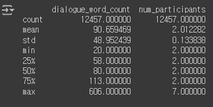

#### 5.4.2. EDA

##### train.csv
- **대화 길이**: 평균 대화 길이는 약 91 단어이며, 대화의 최소 길이는 20 단어, 최대 길이는 606 단어입니다.
- **참여자 수**: 대부분의 대화에서 2명이 대화를 나누고 있으며, 최소 2명에서 최대 7명이 대화에 참여합니다.
- **토큰화 작업**: 
  - 베이스 라인 코드에는 이미 Hugging Face의 AutoTokenizer를 사용하여 BART 모델에 맞게 토큰화 작업이 포함되어 있습니다.
  - AutoTokenizer는 문장을 모델 입력에 맞게 적절한 토큰으로 변환하며, 패딩, 트렁케이션, 그리고 추가적인 special token을 처리해줍니다.
- **데이터 형태**: 총 12,457개의 행과 4개의 열로 구성되어 있습니다.
- **결측값**: 모든 열(fname, dialogue, summary, topic)에 결측값이 없습니다.

##### dev.csv
- **데이터 형태**: 총 499개의 행과 4개의 열로 구성되어 있습니다.
- **결측값**: 모든 열(fname, dialogue, summary, topic)에 결측값이 없습니다.
- **기본 통계**:
  - 모든 열이 텍스트 데이터로 구성되어 있으며, 숫자형 데이터는 없습니다.
  - 각 행은 고유한 데이터로 구성되어 있으며, fname과 dialogue 열의 항목은 모두 고유합니다.
  - topic 열은 446개의 고유한 값을 가지고 있으며, 가장 많이 등장하는 주제는 “직업 면접”으로 9번 등장합니다.
  - 열 데이터 타입: 모든 열은 object 타입, 즉 문자열 데이터로 이루어져 있습니다.

- **Dialogue (대화) 길이**:
  - 평균 길이: 432자
  - 최소 길이: 132자
  - 최대 길이: 1484자
  - 중앙값(50%): 392자

- **Summary (요약문) 길이**:
  - 평균 길이: 81자
  - 최소 길이: 25자
  - 최대 길이: 263자
  - 중앙값(50%): 74자

---

#### 5.4.3. 가정
- 대화문은 영어를 번역한 것이어서 부자연스럽다.
- 한국어를 요약에 최적화된 모델은 제한적이지만, 영어를 요약하는데 최적화된 모델은 많다.
- **한국어 대화문을 영어로 번역 – 영어 요약 – 한국어 번역의 과정을 거치면 어떨까?**

---

#### 5.4.4. 접근방법 리서치
- **다중 작업 학습(Multi-Task Learning)**: 여러 작업을 동시에 수행하여 성능을 향상시키는 방법.
- **다단계 시퀀스 작업(Multi-Step Sequence Task)**: 여러 단계를 순차적으로 수행하여 작업 성능을 향상.
- **시퀀스-투-시퀀스 모델 및 트랜스포머 기반 접근법**: Transformer 기반의 모델을 활용한 시퀀스 작업.
- **복합 모델(Ensemble Model) 접근법**: 각 단계에 최적화된 작은 모델들을 결합하여 성능 향상.
- **단일 네트워크에서 번역 및 요약 수행**: 최신 모델을 사용해 번역과 요약을 동시에 수행.

---

#### 5.4.5. 방향 설정
- **단일 네트워크에서 번역 및 요약 수행**
- **번역과 요약을 나눠서 API 및 모델 활용**
- **베이스라인 코드 디벨롭**
- **“AI Hub 멀티세션 대화”**에 이미 학습되어 있는 모델 사용

   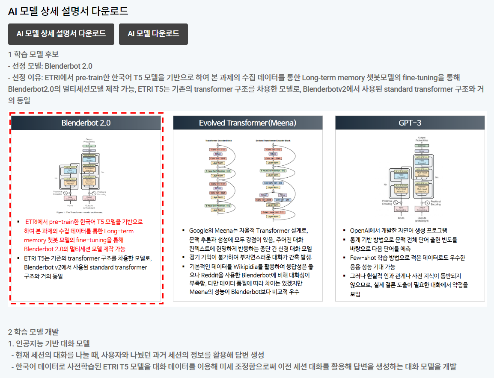
   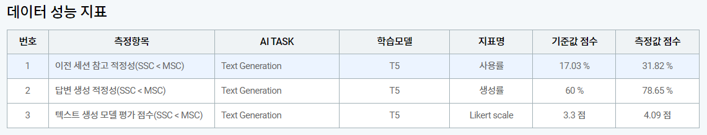
---

#### 5.4.6. 검증
- **단일 네트워크에서 번역 및 요약 수행**: 최신 모델이나 GPT-4 같은 유료 API 모델을 사용하는 것이 적합하지만, 실험 환경에서는 제한적.
- **번역과 요약을 나눠서 API 및 모델 활용**: DeepL API, NLLB200, mBART50 등의 모델을 번역에 사용하고, T5와 mBART로 요약을 시도.
- **베이스라인 코드 디벨롭**: 다른 팀원이 번역-요약-번역 테스트를 진행하며, 역할 분담을 통해 작업 수행.

---

#### 5.4.7. 결론 및 아쉬운 점
- **기본 모델**: 성능이 낮았으며, Large 모델이나 최신 모델은 GPU 메모리 문제로 실행하기 어려웠음.
- **제한적인 환경**에서 실행 가능한 중간 단계의 모델을 사용하여 기본적인 실험을 진행.
- 대부분 베이스라인 코드 점수보다 낮은 결과로 업데이트에 어려움을 겪음.
- 유료 API나 Large 모델을 충분히 실험하지 못한 점이 아쉬움.
- AI Hub 멀티세션 대화 모델 테스트를 진행하지 못함.
- **영어 요약 vs 한국어 요약 점수 산출**에서 중간 코딩 오류로 영어 요약 데이터를 기반으로 Rouge 점수를 산출.
- 아래 점수는 영어 요약 vs 한국어 요약 산출 점수임: 중간 코딩을 잘못해서 영어 요약 데이터로 Rouge 점수 산출함.

   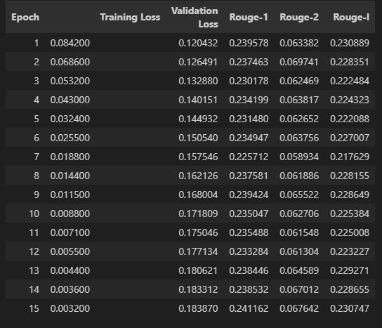

#### 5.4.8. 인사이트
실험 데이터에 따르면, 성능이 개선된 모델은 여러 시도를 통해 점차 성능을 높여가는 방식으로 이루어졌습니다. 다음은 성능이 개선된 모델의 중요한 특징 및 주요 변경 사항입니다:

 1. **모델 아키텍처 변경**
   - **Baseline 모델**: BART 기반의 기본 모델을 사용했으며, 초기 성능은 **42.0793**으로 기록되었습니다.
   - **개선된 모델**: 다양한 트랜스포머 기반 모델을 실험하였고, 특히 BART와 T5 모델이 효과적으로 사용되었습니다. 특히 **mBART**와 **T5** 모델을 통해 성능이 향상되었습니다.

 2. **하이퍼파라미터 조정**
   - **Batch Size 증가**: 학습 시 Batch Size를 증가시키면서 모델의 성능이 개선되었습니다. 더 큰 Batch Size는 학습 안정성에 도움을 주었습니다.
   - **Learning Rate 최적화**: 학습 속도와 성능의 균형을 맞추기 위해 Learning Rate를 조정하였으며, 적절한 Learning Rate 값은 성능 개선에 기여했습니다.

 3. **데이터 전처리 개선**
   - **영어 번역 후 요약**: 한국어 대화 데이터를 영어로 번역한 후, 영어 요약 모델을 적용한 뒤 다시 한국어로 번역하는 과정을 거쳤습니다. 이 접근법은 BART 및 mBART 모델을 활용해 성능을 개선하는 데 중요한 역할을 했습니다.

 4. **모델 튜닝 및 Fine-Tuning**
   - **Pre-trained 모델 Fine-Tuning**: 사전 학습된 모델을 Fine-Tuning하는 과정에서 더 많은 도메인 특화 데이터를 사용한 것이 성능 향상에 도움이 되었습니다. 특히 **다국어 요약 모델**을 활용하여 한국어 데이터의 특성을 반영하려고 했습니다.

 5. **최종 성능 개선 결과**
   - 모델 성능이 **Baseline 모델** 대비 Rouge 점수에서 현저히 향상되었으며, 여러 실험을 통해 더 나은 결과를 도출해냈습니다. 특히, 중간 실험에서는 번역 후 요약 방법이 가장 유효한 접근으로 나타났습니다.

성능 개선의 주요 요인은 **모델 아키텍처의 변경, 하이퍼파라미터 조정, 데이터 전처리 기법의 적용**에서 비롯되었습니다.

### 5.5. 개인 모델 실험 (위효연)

#### 5.5.1. 실험 히스토리

1. 초기 baseline의 kobart모델 파라미터를 바꿔가면서 몇번 실행, 결과값 좋지않음
2. 실험중 경탁님 40점대 넘은 코드를 확인 후. lcw99/t5 모델 적용하여 실행 한번 돌릴때마다 20시간씩 걸려서, 중간에 몇번씩 중단(컴퓨터 문제, 서버 문제 등등) 3-4일 낭비. 
3. 멘토링 후 deepl, chatgpt turbo 3.5, claude등의 api를 이용하여 원문을 다시 번역을 하려했으나, 1. 유료사용 2. api적용하면서 코드에러.. 2-3일간 헤맴  3. 결국 결과값을 도출하여 제출하였으나 output.csv파일 submission에러를 해결못함.
4. 기존 모델들 결과값들을 모아서 ensemble 단순 하드 보팅(가장 점수높음), 가중치 소프트 보팅(점수 내려감), 진행함…  언어를 보팅하는것에대해 의문이 들었지만 결과값이 나쁘지 않았으므로 그냥 넘어감. 
5. LLM테스트 요약에 관한 논문 리뷰
   - https://didi-universe.tistory.com/entry/LLM-LLM-텍스트-요약-평가-관련-논문-리뷰

   - https://arxiv.org/abs/2309.09558

   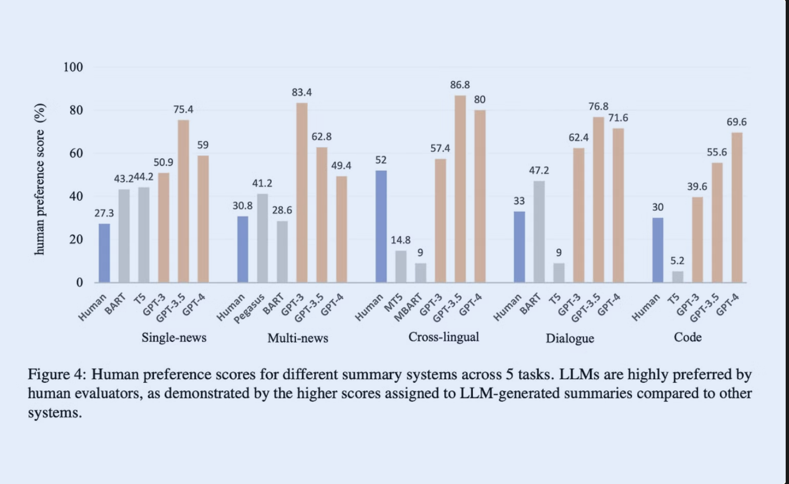

6. 수정된 번역본 summarization은 기존 보다 더 나아보였으나.. 계속 submission에러가 떠서 제출못함.
   ```
   실제 생성요약모델 적용하는것보다 chatgpt, claude등의 llm의 번역이 더 원활한것을 실제 눈으로 확인함(아래 사진첨부) → 다만 api번역해서 요약한것의 결과값을 제출실패.  최종결과물은 t5모델과 kobart를 섞은 앙상블 보팅한 결과값이었으나 실수로 2번 제출된 값이 가장 높은 점수를 받아. 똑같은 점수 2개가 최종으로 submission됨. (추정하건데 그래서 등수가 내려간듯..)
   ```


   ```markdown
   기존모델: 더슨 씨는 #Person1# 에게 모든 사무실 통신이 이메일 통신과 공식 메모로 제한된다고 말합니다. 이는 사무실 내의 직원들 사이뿐만 아니라 외부 통신에도 적용되므로, #Person2# 는 직원들이 메시지를 계속 사용하는 경우 경고를 받게 될 것이라고 경고합니다. "
   1. test_0: #Person1#은 더슨 씨에게 모든 사무실 통신이 이메일과 공식 메모로 제한되며 즉시 메시지 프로그램을 사용할 수 없다고 알립니다. 또한, 직원들이 새로운 정책에 대한 질문이 있으면 부서장에게 직접 문의해야 한다고 말합니다.

   기존모델:test_1," #Person2# 는 교통 체증에 걸렸다. #Person1# 은 #Person2# 가 대중교통을 이용하기 시작한다면 더 좋을 것이라고 생각한다. #Person3# 는 지하철을 타는 것이 운전하는 것보다 훨씬 스트레스를 덜 받을 수 있을 것이라고 생각하고, 출근할 때 운전하지 않는 것을 제안한다. "
   2. test_1: #Person2#가 교통 체증에 걸렸습니다. #Person1#은 #Person2#에게 대중교통을 이용하거나 날씨가 좋은 날에는 자전거로 출근하라고 제안합니다.

   ** 기존모델: test_4, #Person2# 는 #Person1# 에게 올림픽 스타디움에 5000개의 좌석이 있다고 말한다. #Person2# 의 표지판은 등반 금지이다
   4. test_4: #Person2#는 #Person1#에게 올림픽 스타디움이 6월에 완공될 예정이며, 5000개의 좌석과 등반 금지 표지판이 설치될 것이라고 말합니다.

   ** 기존모델: test_5, #Person2# 는 #Person1# 에게 사업 계획서를 작성하고 투자자를 모집하는 것이 #Person2# 의 회사에서 일하는 것에 아무런 도움이 되지 않는다고 말한다.                        
   5. test_5: #Person1#은 회사가 자신에게 도움이 되지 않는다고 생각하여 직접 사업 계획서를 작성하고 투자자를 모집하기로 결정했습니다.

   ```
   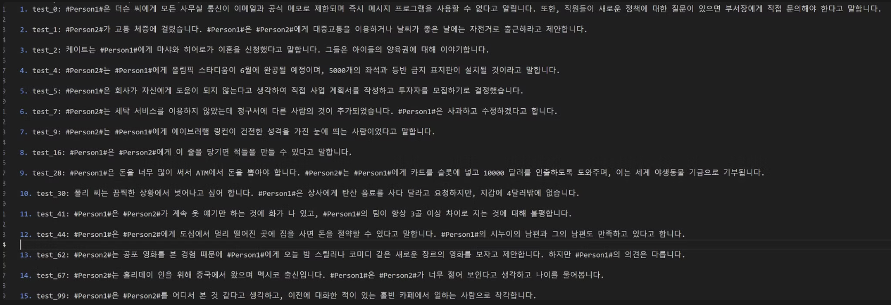

#### 5.5.2. 결론
한계와 제약에 대해서 생각해 볼 수 있는 대회였음. 시간과 memory문제로 과거 어떤 프로젝트보다 feedback사이클이 느리게 작동하다보니. 결과적으로 작업이 비효율적으로 진행이 됨. 베이스라인, 파라미터 수정, llm api적용하면서 코딩실력에 부족함을 느낌

## 6. Result

#### Final(Public) - Rank 3

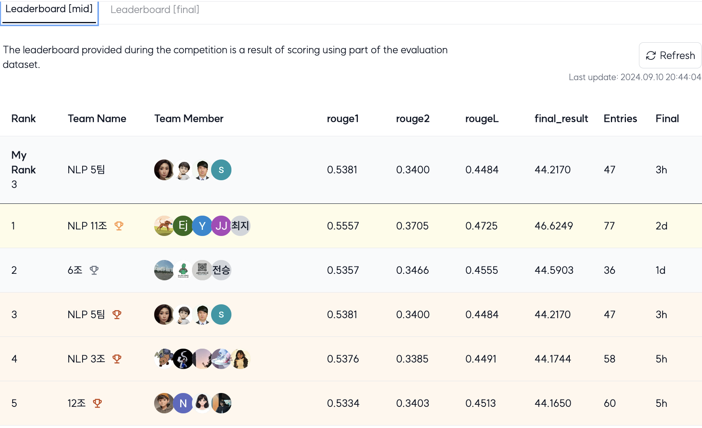

#### Final(Private) - Rank 7

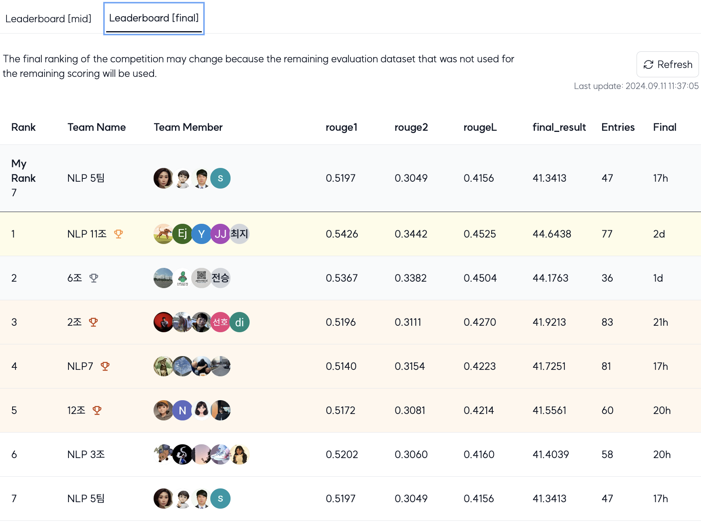


#### Submit history

**soft_voting_v3**, **ensemble_v1** was submitted!!! 

| Model Name               | Submitter | rouge1 | rouge1 (Final) | rouge2 | rouge2 (Final) | rougeL | rougeL (Final) | final_result | final_result (Final) | Created at           | Phase    |
|--------------------------|-----------|--------|----------------|--------|----------------|--------|----------------|--------------|----------------------|----------------------|----------|
| voting_translated_v1      | 위효연    | -      | -              | -      | -              | -      | -              | -            | -                    | 2024.09.10 18:23     | Failed   |
| soft_voting_v4            | 위효연    | 0.5230 | 0.4977         | 0.3273 | 0.2887         | 0.4351 | 0.4001         | 42.8463      | 39.5497              | 2024.09.10 18:07     | Complete |
| **soft_voting_v3**            | 위효연    | 0.5381 | 0.5197         | 0.3400 | 0.3049         | 0.4484 | 0.4156         | 44.2170      | 41.3413              | 2024.09.10 18:05     | Complete |
| **ensemble_v1**               | 위효연    | 0.5381 | 0.5197         | 0.3400 | 0.3049         | 0.4484 | 0.4156         | 44.2170      | 41.3413              | 2024.09.10 17:41     | Complete |
| ensemble_v1               | 위효연    | -      | -              | -      | -              | -      | -              | -            | -                    | 2024.09.10 17:18     | Failed   |
| soft_voting_v2            | 위효연    | -      | -              | -      | -              | -      | -              | -            | -                    | 2024.09.10 17:02     | Failed   |
| soft_voting_v1            | 위효연    | 0.1426 | 0.1178         | 0.0809 | 0.0647         | 0.1323 | 0.1086         | 11.8617      | 9.7053               | 2024.09.10 16:35     | Complete |
| mBart_T5                  | 한아름    | -      | -              | -      | -              | -      | -              | -            | -                    | 2024.09.10 14:35     | Failed   |
| lcw99_v1                  | 위효연    | 0.1403 | 0.1182         | 0.0801 | 0.0654         | 0.1306 | 0.1088         | 11.6991      | 9.7427               | 2024.09.10 13:17     | Complete |
| lcw99_v1                  | 위효연    | -      | -              | -      | -              | -      | -              | -            | -                    | 2024.09.10 13:13     | Failed   |
| lcw99_v1                  | 위효연    | -      | -              | -      | -              | -      | -              | -            | -                    | 2024.09.10 13:09     | Failed   |
| lr56wd01_153...12113      | 백경탁    | 0.5337 | 0.5179         | 0.3358 | 0.3022         | 0.4436 | 0.4136         | 43.7716      | 41.1227              | 2024.09.09 20:07     | Complete |
| lr16wd01gml4...99312      | 백경탁    | 0.5236 | 0.5156         | 0.3246 | 0.3029         | 0.4295 | 0.4073         | 42.5907      | 40.8578              | 2024.09.09 01:43     | Complete |
| test                      | 한아름    | 0.5123 | 0.4890         | 0.3169 | 0.2813         | 0.4238 | 0.3913         | 41.7678      | 38.7205              | 2024.09.08 16:21     | Complete |
| test4                     | 한아름    | 0.2033 | 0.2183         | 0.0589 | 0.0615         | 0.1434 | 0.1534         | 13.5175      | 14.4369              | 2024.09.07 23:04     | Complete |
| lr56wd01gml2...87199      | 백경탁    | 0.5397 | 0.5167         | 0.3389 | 0.3032         | 0.4449 | 0.4135         | 44.1172      | 41.1148              | 2024.09.07 22:01     | Complete |
| test3                     | 한아름    | 0.2018 | 0.2124         | 0.0574 | 0.0597         | 0.1411 | 0.1490         | 13.3452      | 14.0376              | 2024.09.07 21:53     | Complete |
| lr25wd01gml1...12460      | 백경탁    | 0.5254 | 0.5155         | 0.3291 | 0.3012         | 0.4368 | 0.4118         | 43.0424      | 40.9510              | 2024.09.07 07:39     | Complete |
| lr35wd01gml1...21805      | 백경탁    | 0.5258 | 0.5203         | 0.3278 | 0.3043         | 0.4375 | 0.4184         | 43.0404      | 41.4312              | 2024.09.07 07:30     | Complete |
| lr55wd01gml9...-9345      | 백경탁    | 0.5342 | 0.5159         | 0.3368 | 0.3034         | 0.4446 | 0.4132         | 43.8507      | 41.0835              | 2024.09.06 19:08     | Complete |
| lr56wd01gml8...43610      | 백경탁    | 0.5306 | 0.5112         | 0.3297 | 0.2956         | 0.4387 | 0.4059         | 43.3022      | 40.4209              | 2024.09.06 15:11     | Complete |
| lr56wd01gml1...37377      | 백경탁    | 0.5359 | 0.5169         | 0.3352 | 0.3040         | 0.4448 | 0.4120         | 43.8619      | 41.0979              | 2024.09.06 08:27     | Complete |
| lr56wd01gml1...53989      | 백경탁    | 0.5339 | 0.5167         | 0.3316 | 0.3028         | 0.4402 | 0.4106         | 43.5203      | 41.0018              | 2024.09.06 08:15     | Complete |
| lr56wd01gml1...45683      | 백경탁    | 0.5379 | 0.5162         | 0.3360 | 0.2996         | 0.4456 | 0.4075         | 43.9835      | 40.7764              | 2024.09.06 07:53     | Complete |
| lr56wd01gml5...40495      | 백경탁    | 0.5314 | 0.5093         | 0.3331 | 0.2960         | 0.4377 | 0.4019         | 43.4053      | 40.2385              | 2024.09.05 18:42     | Complete |
| lr56wd01gml5...28035      | 백경탁    | 0.5282 | 0.5112         | 0.3338 | 0.2984         | 0.4381 | 0.4019         | 43.3380      | 40.382

### Mentoring history

**멘토링 일시:** 9/9(월) 10:00 ~ 11:00  
**멘토:** 이가람 멘토님  
**참여자:** 박석(멘토님의 일정변경으로 아쉽게 불참), 백경탁, 한아름, 위효연

#### 주요 질문 및 답변

1. **[박석] Baseline 코드 성능 저하 문제**
   - **질문:** Baseline 코드를 변형한 두 가지 버전(Lightening, Ignite)이 성능이 Baseline 대비 약 2/3 정도 수준입니다. 성능을 개선할 수 있는 방법은?
   - **답변:** 코드 간 비교가 필요하며, 추가적인 정보가 있어야 분석 및 개선이 가능합니다.

2. **[백경탁] 파라미터 최적화 방법**
   - **질문:** 파라미터 최적화를 더 쉽게 할 수 있는 방법이 있을까요? 
   - **답변:** 
     - Kobart 모델은 성능이 높아 더 나은 모델을 선택하기 어려울 수 있습니다.
     - 휴리스틱 방법을 사용하거나, Learning rate 스케줄러, WandB 사용을 추천합니다.
     - 파라미터 최적화 도구로는 GridSearch, RandomSearch, HyperOPT, RayTune 등을 사용할 수 있습니다.

3. **[위효연] Summarization에 적합한 LLM 추천**
   - **질문:** Summarization에 적합한 LLM 모델 추천을 부탁드립니다.
   - **답변:** KoBART, T5, GPT2, Pegasus 모델을 추천합니다.

4. **[한아름] 번역 - 요약 - 번역 프로세스**
   - **질문:** ‘번역(한국어->영어) - 요약 - 번역(영어->한국어)’ 과정에 대한 추천 방법?
   - **답변:** Deepl API와 BART 모델을 사용한 번역 및 요약 파이프라인을 추천.

5. **성능을 높이는 방법**
   - **질문:** 성능을 높일 수 있는 다른 방법은?
   - **답변:** EDA(Easy Data Augmentation) 기법을 적용해 KoEDA 모듈로 데이터 증강을 시도해 볼 수 있습니다.

이 멘토링 세션에서는 경진대회 참여자들이 Baseline 성능 개선, 파라미터 최적화, 적합한 모델 선택, 번역-요약 파이프라인 등에 대한 실질적인 조언을 받았습니다.

### Presentation

- - [UpStageAILAB-3rd-Competition-NLP-Summarization-Presentation-TEAM5-20240911.pptx](https://docs.google.com/presentation/d/19L223VQDM724Fta0g4yWIgGJraOKgFw5/edit?usp=sharing&ouid=102302788798357252978&rtpof=true&sd=true)


## etc

### Meeting Log

- [Team 5 Notion](https://www.notion.so/5-a585789549154cb5826a268dc4e864ca) 참조

### Reference

- 위 개인별 실험 일지 참조
